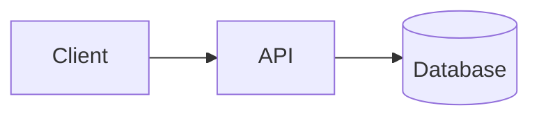

# Blog content

Posts are plain Markdown files in this directory. Drop a `.md` file here and it
shows up automatically — the filename (minus `.md`) becomes the URL slug, e.g.
`csi-drivers.md` → `/blog/csi-drivers`.

## Frontmatter

Every post starts with a YAML frontmatter block:

```markdown
---
title: "Your Post Title"
date: "2026-07-25"            # YYYY-MM-DD, controls sort order + display
excerpt: "One-line summary shown on the index and in social/SEO cards."
tags: ["kubernetes", "devops"]
cover: "/blog/my-post/cover.jpg"   # optional; omit to use the site OG image
---

Your markdown body starts here.
```

- `title`, `date`, `excerpt` are required.
- `tags` and `cover` are optional. If `cover` is omitted, the post falls back to
  the default `/og-image.jpg` for social/SEO cards. If you set `cover`, put the
  image under `public/` (e.g. `public/blog/my-post/cover.jpg`).

## What you can write

Standard GitHub-flavored markdown works: headings, **bold**, `inline code`,
lists, tables, blockquotes, links, images.

### Code blocks

Fenced code blocks are syntax-highlighted and get a **copy button** (with a
glare sweep on copy) automatically:

````markdown
```yaml
apiVersion: v1
kind: Pod
```
````

### Mermaid diagrams

Use a ```mermaid fenced block. It renders as an interactive diagram (zoom, pan,
vertical resize, trackpad/touch gestures), themed to match the site:

````markdown

````

Prefer **left-to-right** layouts (`graph LR`, or `direction LR` inside
subgraphs) — they read best in landscape. Sequence diagrams are horizontal by
default.

### Embeds

- **YouTube / iframes** — paste a raw `<iframe>`; it gets a responsive 16:9
  wrapper automatically.
- **Video files** — a raw `<video src="...">` gets controls + lazy loading.
- **Images** — standard `` markdown; served unoptimized (static
  export), lazy-loaded, with the site's rounded-border styling.

## After adding a post

The build regenerates the index, RSS feed (`/rss.xml`), and sitemap
automatically. Just commit the `.md` file — no code changes needed.
