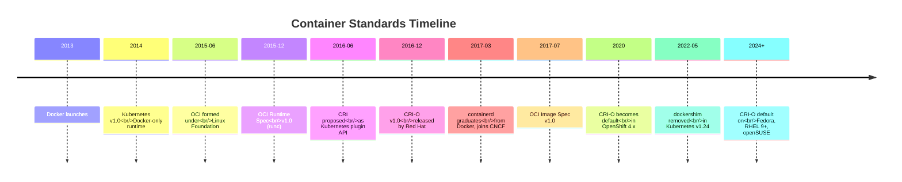
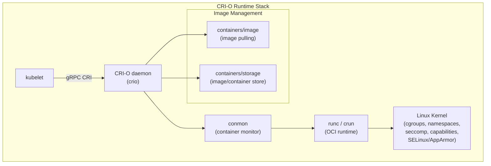
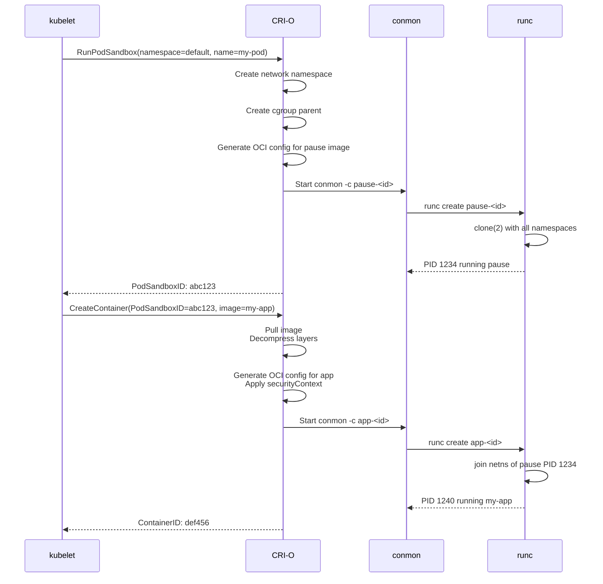

CRI-O is not the most famous container runtime. Docker has the name recognition. containerd has the wider install base (GKE, EKS, and most of the public cloud). But CRI-O occupies a specific and important niche: it is the runtime that was **designed for Kubernetes and nothing else**.

This post traces the full story: why Kubernetes needed the Container Runtime Interface in the first place, how CRI-O was born at Red Hat, the architectural decisions that make it distinct, its relationship with OCI runtimes and conmon, and why it matters more today than when it launched.

---

## Act 1: The Docker Monoculture

In the beginning (mid-2014), Kubernetes managed containers by talking to Docker directly. kubelet called the Docker API through a library called `kubelet/dockertools` and later `dockermanager`. If you ran `docker ps` on a Kubernetes node, you'd see the pause containers and your application containers managed directly by Docker.

This was simple for users but fragile for Kubernetes:

- **API coupling:** Kubernetes was tied to Docker's specific API version. A breaking change in Docker's API required a Kubernetes release to adapt.
- **Feature coupling:** Kubernetes wanted features like container checkpointing and sandbox isolation that Docker didn't prioritize.
- **Competitive pressure:** Docker, Inc. was developing its own orchestration tool (Docker Swarm) — a direct competitor. The Kubernetes community didn't want their project's core runtime controlled by a competitor.

Then in 2015, Docker, Inc. announced **rkt** (pronounced "rocket"), a competing container runtime from CoreOS. The Kubernetes community realized they needed a **plugin interface**, not a SDK dependency.

### The Open Container Initiative (OCI)

Before CRI, there was OCI. In June 2015, Docker, CoreOS, Google, Red Hat, and others formed the **Open Container Initiative** under the Linux Foundation. OCI defined two specifications:

1. **OCI Image Spec (v1.0, July 2017):** How container images are built, stored, and named — layers, manifests, configs. This is why `docker build` output can run on CRI-O, containerd, Podman, or any OCI-compatible runtime.
2. **OCI Runtime Spec (v1.0, July 2017):** What happens at runtime — the filesystem bundle, the configuration JSON (config.json), and the lifecycle (create, start, stop, delete). This is what `runc` implements.

OCI created a common language: any OCI image can run on any OCI-compatible runtime. But it didn't solve the Kubernetes integration problem — there was still no standard way for kubelet to *tell* a runtime to run a container.



## Act 2: The CRI Specification

In June 2016, the Kubernetes community proposed the **Container Runtime Interface (CRI)** — a protobuf-based gRPC API that would become the standard contract between kubelet and any container runtime.

The CRI specification defined two gRPC services:

### RuntimeService

```
service RuntimeService {
    // Sandbox management (Pod lifecycle)
    rpc RunPodSandbox(RunPodSandboxRequest) returns (RunPodSandboxResponse);
    rpc StopPodSandbox(StopPodSandboxRequest) returns (StopPodSandboxResponse);
    rpc RemovePodSandbox(RemovePodSandboxRequest) returns (RemovePodSandboxResponse);
    rpc PodSandboxStatus(PodSandboxStatusRequest) returns (PodSandboxStatusResponse);
    rpc ListPodSandbox(ListPodSandboxRequest) returns (ListPodSandboxResponse);

    // Container management
    rpc CreateContainer(CreateContainerRequest) returns (CreateContainerResponse);
    rpc StartContainer(StartContainerRequest) returns (StartContainerResponse);
    rpc StopContainer(StopContainerRequest) returns (StopContainerResponse);
    rpc RemoveContainer(RemoveContainerRequest) returns (RemoveContainerResponse);
    rpc ContainerStatus(ContainerStatusRequest) returns (ContainerStatusResponse);
    rpc ListContainers(ListContainersRequest) returns (ListContainersResponse);

    // Execution and streaming
    rpc ExecSync(ExecSyncRequest) returns (ExecSyncResponse);          // kubectl exec without terminal
    rpc Exec(ExecRequest) returns (ExecResponse);                      // kubectl exec -it
    rpc Attach(AttachRequest) returns (AttachResponse);                // kubectl attach
    rpc PortForward(PortForwardRequest) returns (PortForwardResponse); // kubectl port-forward

    // Container stats
    rpc ContainerStats(ContainerStatsRequest) returns (ContainerStatsResponse);
    rpc ListContainerStats(ListContainerStatsRequest) returns (ListContainerStatsResponse);
}
```

### ImageService

```
service ImageService {
    rpc PullImage(PullImageRequest) returns (PullImageResponse);
    rpc ListImages(ListImagesRequest) returns (ListImagesResponse);
    rpc ImageStatus(ImageStatusRequest) returns (ImageStatusResponse);
    rpc RemoveImage(RemoveImageRequest) returns (RemoveImageResponse);
    rpc ImageFsInfo(ImageFsInfoRequest) returns (ImageFsInfoResponse);
}
```

The key insight of CRI is the **Pod Sandbox** concept. A Pod is not a container; it's a sandbox (network namespace, PID namespace, cgroup parent) that contains multiple containers. The sandbox is created with `RunPodSandbox` first, and then containers are created inside it. This is the gRPC-level expression of the pause container pattern.

### The dockershim compromise

Docker never implemented CRI natively. Instead, the Kubernetes community built a bridge called **dockershim** — a translation layer that lived inside the Kubernetes source tree at `pkg/kubelet/dockershim/`. It received CRI calls from kubelet and translated them into Docker API calls.

The dockershim was explicitly intended as a temporary solution. It added latency (every CRI call became two calls: CRI → Docker API → containerd), it duplicated code, and it locked Kubernetes into Docker's specific behavior. But it allowed users to keep using Docker while CRI-compliant runtimes matured.

That "temporary" shim lasted **six years** — from Kubernetes v1.5 (December 2016) through v1.23 (December 2021). It was finally removed in **Kubernetes v1.24** (May 2022), forcing every cluster onto a CRI-compliant runtime.

## Act 3: CRI-O Is Born

While dockershim was being built, Red Hat engineers saw a cleaner path. If Kubernetes needed a CRI-compliant runtime, why not build one from scratch — one that didn't carry Docker's legacy API, didn't need a shim, and was optimized exclusively for kubelet's use case?

The project, initially called **oci-unite** and then **CRI-O**, was announced in December 2016. The first commit was made by Antonio Murdaca (Runcom) and Mrunal Patel. The project's stated goal:

> *CRI-O is an implementation of the Kubernetes CRI to enable using OCI (Open Container Initiative) compatible runtimes. It is a lightweight alternative to using Docker, Moby or rkt as the runtime for Kubernetes.*

The name says it all: **C**RI **O**CI — the bridge between the Kubernetes CRI and OCI-compliant runtimes.

### The architecture



**1. kubelet → CRI-O (gRPC):** kubelet connects to CRI-O's Unix socket (`/var/run/crio/crio.sock`). It sends CRI calls like `RunPodSandbox` with the Pod's full configuration (Linux capabilities, seccomp profile, SELinux labels, mount paths, environment variables).

**2. CRI-O daemon:** The Go daemon (`crio`) translates each CRI call into OCI operations:
- For `RunPodSandbox`: creates a **network namespace** and a **cgroup parent**, generates the OCI `config.json` for the pause container, and calls runc to start it.
- For `CreateContainer`: pulls the image (if not cached), decompresses the layers into the storage backend, creates a writable layer (overlayfs), generates the OCI `config.json` with the user's command, environment, mounts, capabilities, and security settings.
- For security, CRI-O translates Kubernetes security context fields into OCI config fields: `runAsUser` → `config.json.process.user.uid`, `capabilities.drop` → `config.json.process.capabilities.bounding` minus the dropped caps, `seccompProfile` → `config.json.linux.seccomp`.

**3. conmon (container monitor):** Conmon is a tiny C program (approximately 500 lines) that holds the container's:
- **stdout/stderr pipes**, which kubelet reads via `kubectl logs`. The pipes are connected to the container's stdout/stderr file descriptors via `conmon -c <container-id> -l <log-path>`.
- **PID file**, so CRI-O can track the container's lifecycle.
- **Exit code file**, written atomically by conmon when the container exits. This is how `kubectl get pods` shows `Status: Completed` vs `Status: Error`.
- **Signal forwarding**. When kubelet sends `SIGTERM` to a container, CRI-O calls `StopContainer`, which tells conmon to forward the signal. Conmon sends `SIGTERM` and, after a timeout, `SIGKILL`.

Because conmon is a C program, it avoids Go's garbage collection pauses and scheduler latency. This matters for signal delivery — when kubelet says "stop this container in 30 seconds," conmon can deliver the `SIGKILL` at precisely the right millisecond without GC interference.

**4. runc / crun:** The OCI runtime receives the bundle (a directory containing `config.json` and the rootfs) and makes the final Linux system calls: `clone(2)` with `CLONE_NEWNS | CLONE_NEWUTS | CLONE_NEWIPC | CLONE_NEWPID | CLONE_NEWNET | CLONE_NEWUSER` to create namespaces, `unshare(2)` for the cgroup namespace, `pivot_root(2)` to change the mount point, and `execve(2)` to start the container's init process.

The two main OCI runtimes are:

| Runtime | Language | Key feature |
|---------|----------|-------------|
| **runc** | Go (with C library for cgroup/namespace setup) | The reference implementation, created by Docker, donated to OCI |
| **crun** | C | Faster (no Go runtime startup), lower memory (~5MB vs ~15MB per process) |
| **youki** | Rust | Newer, memory-safe, still maturing |

### The pod sandbox in detail

CRI-O's handling of the Pod Sandbox is architecturally interesting:



The pause container (from `registry.k8s.io/pause:3.9`) runs first and holds the network namespace. Every application container joins that namespace. When the Pod is deleted, CRI-O kills the application containers first, then the pause container, which destroys the namespace.

### Image management

CRI-O uses two libraries from the containers ecosystem:

- **`containers/image`** — handles pulling images from registries (Docker Hub, Quay, GCR, private registries with auth). Supports OCI format, Docker format, and transparent decompression.
- **`containers/storage`** — manages the local image and container store (layers, mounts, overlayfs). This is the same library used by Podman, Buildah, and Skopeo.

Images are stored using overlayfs: each layer is a separate directory, and the writable container layer is an overlay mount combining all layers. This is identical to how Docker stores images, but using the shared `containers/storage` library instead of Docker's proprietary graphdriver.

## CRI-O vs containerd: The Technical Differences

CRI-O and containerd are the two dominant CRI implementations. They solve the same problem but with different design philosophies.

| Aspect | CRI-O | containerd |
|--------|-------|------------|
| **Origin** | Red Hat, 2016, purpose-built for CRI | Docker, Inc., 2017, extracted from Docker engine |
| **CRI implementation** | Native — every CRI call maps to one code path | Through `cri-containerd` plugin, which is a CRI shim over containerd's internal API |
| **Codebase size** | ~80K lines of Go | ~200K lines of Go + C bindings |
| **Image management** | `containers/image` + `containers/storage` (shared with Podman, Buildah) | Built-in content store (derived from Docker's distribution library) |
| **CLI tools** | `crictl` (shared with containerd), `crioctl` (deprecated), `podman` (for debugging) | `crictl`, `ctr` (containerd's own CLI) |
| **Default in** | OpenShift 4.x, Fedora CoreOS, RHEL 9+, openSUSE MicroOS | GKE (historical default), EKS, AKS, Docker Desktop, Rancher |
| **Pause image** | `k8s.gcr.io/pause:3.9` | Same (both use Kubernetes-provided pause) |
| **SELinux support** | First-class — per-pod MCS labels, automatic context assignment | Supported but historically needed manual configuration |
| **CRIU support** | Built-in — `criu` integration for checkpoint/restore | Via containerd's checkpoint plugin |
| **Startup time (cold cache)** | ~1–2s per Pod | ~1–3s per Pod |
| **Resident memory (idle)** | ~30MB (CRI-O daemon) | ~50MB (containerd daemon) |

### The SELinux advantage

CRI-O's tight integration with SELinux is its strongest differentiator. On Red Hat-based systems (RHEL, CentOS, Fedora CoreOS, OpenShift), SELinux is mandatory — the system enforces it even if you don't configure it.

CRI-O assigns every Pod a unique **MCS (Multi-Category Security)** label:

```
system_u:system_r:container_t:s0:c128,c512
```

The labels `c128,c512` are randomly generated per Pod. Because every Pod gets a unique label, SELinux prevents:
- Container A reading Container B's files (different MCS categories — SELinux denies cross-category access)
- Container A sending signals to Container B's processes (SELinux denies cross-category process signaling)
- A compromised container writing to the host filesystem (the type `container_t` is denied write access to host types like `etc_t`, `bin_t`, `var_t`)

This is zero-config container isolation enforced by the kernel. Even if `runc` has a namespace-escape bug, SELinux blocks the breakout at the kernel level because the escaped process still has the `container_t` type.

### Pinned image garbage collection

A practical difference that matters in production: CRI-O's image garbage collector understands which images are in use by running containers via **pinned references**. It will never garbage-collect a layer that's referenced by a running container.

containerd's GC, historically, used a mark-and-sweep algorithm that could race with container startup — a pulled-but-not-yet-running container's layers could be swept. This caused `ImagePullBackOff` errors after node reboots where the GC ran before kubelet recreated Pods. CRI-O avoids this entirely because its storage backend (`containers/storage`) uses reference counting that the GC respects.

### The conmon edge (detailed)

conmon deserves its own section because it's one of the most elegant pieces of the CRI-O architecture.

```c
// conmon — pseudocode for the core loop
int main(int argc, char *argv[]) {
    int masterfd = open_ptmx();        // pseudo-terminal master
    int logfd = open_logfile(argv);    // stdout/stderr log
    pid_t child = fork();

    if (child == 0) {
        // Child: set up namespaces, exec the container
        grantpt(masterfd);
        unlockpt(masterfd);
        setsid();                      // new session
        ioctl(masterfd, TIOCSCTTY);    // acquire controlling terminal
        close(masterfd);
        execve(config->process.path, config->process.args, config->process.env);
        // if execve returns, it failed
        write_exit_code_file(EXIT_FAILURE);
        _exit(EXIT_FAILURE);
    }

    // Parent: monitor loop
    int exit_code = -1;
    struct pollfd fds[] = {
        { .fd = masterfd, .events = POLLIN },     // stdout/stderr
        { .fd = signal_fd, .events = POLLIN },    // SIGTERM/SIGKILL from CRI-O
    };

    while (exit_code < 0) {
        poll(fds, 2, -1);

        if (fds[0].revents & POLLIN) {
            char buf[4096];
            ssize_t n = read(masterfd, buf, sizeof(buf));
            if (n > 0) write(logfd, buf, n);      // copy to log file
        }

        if (fds[1].revents & POLLIN) {
            // Signal from CRI-O: forward to child
            kill(child, pending_signal);
        }

        // Check if child exited (non-blocking)
        int status;
        pid_t ret = waitpid(child, &status, WNOHANG);
        if (ret == child) {
            exit_code = WEXITSTATUS(status);
            write_exit_code_file(exit_code);       // atomic file write
        }
    }

    close(masterfd);
    return exit_code;
}
```

The critical design decision: conmon is a **C program**, not Go. This means:
- No Go runtime overhead (no GC, no goroutine scheduler) for the tight polling loop
- Atomic exit-code file writing without GC pauses
- Reliable signal delivery — `SIGTERM` from CRI-O reaches the container's init process within microseconds, not milliseconds
- Minimal memory (~2MB vs ~10MB for a Go equivalent)

## CRI-O in the Post-dockershim Era

The removal of dockershim in Kubernetes v1.24 (May 2022) was the inflection point. Every cluster running v1.24+ must use a CRI-compliant runtime. This created a natural experiment: which runtime would users choose?

The data (as of 2025–2026):

| Runtime | Estimated adoption | Typical use case |
|---------|-------------------|-----------------|
| containerd | ~65% | GKE, EKS, AKS default, Docker Desktop, Rancher |
| CRI-O | ~25% | OpenShift, Fedora CoreOS, RHEL, on-prem hardened clusters |
| Other (CRI dockerd, rktlet, frakti) | ~10% | Legacy or specialized |

containerd's adoption lead is largely inherited from Docker — containerd was extracted from Docker Engine in 2017, so clusters that migrated from Docker to containerd had a natural path. CRI-O's adoption is concentrated in environments that value SELinux integration, minimalism, and Red Hat support.

### When to choose CRI-O

1. **You're running OpenShift.** OpenShift 4.x uses CRI-O as the only supported runtime. This is not optional — it's a requirement.
2. **You're on RHEL / Fedora CoreOS.** SELinux is mandatory on these systems, and CRI-O's SELinux integration is the best in class. containerd works, but CRI-O is the recommended and default option.
3. **You want the minimal attack surface.** CRI-O's codebase (~80K LOC) is significantly smaller than containerd's (~200K LOC). Fewer lines of code = fewer potential vulnerabilities.
4. **You need CRIU checkpoint/restore.** CRI-O has native support for checkpointing running containers and restoring them elsewhere — useful for live migration, cluster autoscaler, and node-drain scenarios.
5. **You're building a Kubernetes distro.** If you're packaging Kubernetes for a specific use case (edge, IoT, telco), CRI-O's narrow scope makes it easier to audit, customize, and embed.

### Configuring CRI-O

Here's a minimal CRI-O configuration (`/etc/crio/crio.conf`):

```toml
[crio]
  log_level = "info"

[crio.runtime]
  # Default OCI runtime
  default_runtime = "runc"

  # Additional runtimes
  [crio.runtime.runtimes.runc]
    runtime_path = "/usr/bin/runc"
    runtime_type = "oci"
    runtime_root = "/run/runc"

  [crio.runtime.runtimes.crun]
    runtime_path = "/usr/bin/crun"
    runtime_type = "oci"
    runtime_root = "/run/crun"

  # SELinux settings (RHEL/CoreOS)
  selinux = true
  seccomp_profile = "/etc/crio/seccomp.json"

  # Pause image
  pause_image = "registry.k8s.io/pause:3.9"
  pause_command = "/pause"

[crio.image]
  # Image pull policy
  default_transport = "docker://"

  # Parallel image pulls
  parallel_image_pulls = 3

  # Garbage collection
  [crio.image.gc]
    image_gc_period = "5m"
    image_gc_high_threshold = 85      # percent disk used
    image_gc_low_threshold = 80       # GC until this percent

[crio.network]
  # CNI plugin directory
  network_dir = "/etc/cni/net.d/"
  plugin_dir = "/opt/cni/bin/"
```

## Debugging CRI-O

### crictl — the universal CRI debug tool

`crictl` talks to any CRI-compliant runtime via its socket. It's the single best debugging tool:

```bash
# List all pods and containers
crictl pods
crictl ps -a

# Inspect a specific container
crictl inspect <container-id>

# Get container logs (same as kubectl logs but direct)
crictl logs <container-id>

# Execute a command in a running container
crictl exec -it <container-id> /bin/sh

# Pull an image directly
crictl pull nginx:latest

# Get node-level stats
crictl stats

# Check CRI-O version and status
crictl version
crictl info
```

### Common issues and their causes

| Symptom | Likely cause | CRI-O check |
|---------|-------------|-------------|
| `ErrImagePull` / `ImagePullBackOff` | Registry auth, network, or image name | `crictl pull <image>` to isolate |
| `RunPodSandbox` error | CNI plugin failure or network namespace issue | Check CRI-O logs: `journalctl -u crio` |
| `CreateContainer` error | OCI configuration issue (bad mount, bad security context) | `crictl inspect <container>` to see the rendered config |
| Node disk pressure | Too many images or container layers | Check `crio image gc` thresholds |
| Pod fails to start with SELinux denial | SELinux context conflict | `ausearch -m avc -ts recent` on the node |
| High pod startup latency | Image pull queue or OCI runtime slow | `crictl stats`, check `crun` vs `runc` |

## The Evolution of CRI-O

| Version | Kubernetes | Key changes |
|---------|-----------|-------------|
| v1.0 (Dec 2016) | v1.5 | Initial release |
| v1.12 (2018) | v1.12 | Stable CRI, SELinux MCS labeling, CNI plugin support |
| v1.16 (2019) | v1.16 | `crun` runtime support, improved image GC |
| v1.20 (2020) | v1.20 | OpenShift 4.6 default, drop `crioctl` in favor of `crictl` |
| v1.24 (2022) | v1.24 | CRIU checkpoint/restore, user namespace support |
| v1.26 (2022) | v1.26 | Drop dockershim compatibility artifacts |
| v1.28 (2023) | v1.28 | Conmon-rs (Rust reimplementation of conmon), cgroup v2 default |
| v1.31 (2025) | v1.31 | Full seccomp notifier support, swap management |
| v1.33 (2026) | v1.33 | Conmon-rs stable, image pull metrics, improved swap handling |

## The Ecosystem: Podman, Buildah, and Skopeo

CRI-O is part of a broader Red Hat container toolchain that shares the `containers/storage` and `containers/image` libraries:

- **Podman** — a drop-in replacement for `docker` CLI that runs containers rootless. `podman run` creates containers using the same OCI runtimes (runc, crun) that CRI-O uses.
- **Buildah** — builds OCI images without requiring a container runtime (no `docker build` dependency).
- **Skopeo** — inspects, copies, and signs container images across registries without pulling them locally.

On a Fedora CoreOS node running CRI-O, you can use `podman` to debug containers directly on the node without SSH-ing into containers, because Podman and CRI-O share the same storage backend.

```bash
# See all containers CRI-O is managing via Podman
sudo podman ps -a

# Inspect an image CRI-O pulled
sudo podman inspect registry.k8s.io/pause:3.9
```

## The Mental Model

> CRI-O is the shortest path between kubelet and the Linux kernel for running containers. It translates every CRI call into an OCI bundle, delegates the actual container lifecycle to runc or crun, uses conmon to hold the stdout/stderr pipes and exit codes, and enforces SELinux separation between every Pod. It has no features Kubernetes doesn't need, no Docker compatibility layer, and no external API beyond the CRI gRPC contract. It is the container runtime that was designed for Kubernetes from day one — and after dockershim's removal, it's the runtime that every Kubernetes distribution that values minimalism, security, and Red Hat integration builds on.

---

## References

- [CRI-O GitHub Repository](https://github.com/cri-o/cri-o)
- [CRI-O Documentation](https://cri-o.io/)
- [Introducing CRI in Kubernetes (Dec 2016)](https://kubernetes.io/blog/2016/12/container-runtime-interface-cri-in-kubernetes/)
- [OCI Specification (runtime-spec)](https://github.com/opencontainers/runtime-spec)
- [OCI Specification (image-spec)](https://github.com/opencontainers/image-spec)
- [runc Project](https://github.com/opencontainers/runc)
- [crun Project](https://github.com/containers/crun)
- [conmon Project](https://github.com/containers/conmon)
- [containers/storage Library](https://github.com/containers/storage)
- [containers/image Library](https://github.com/containers/image)
- [Kubernetes v1.24: dockershim Removal](https://kubernetes.io/blog/2022/05/03/kubernetes-1-24-release-announcement/)
- [Podman Project](https://podman.io/)
- [Buildah Project](https://buildah.io/)
- [SELinux Project](https://selinuxproject.org/)
- [KEP-2799: CRI-O Support for CRIU Checkpoint/Restore](https://github.com/kubernetes/enhancements/tree/master/keps/sig-node/2799-crio-criu)
