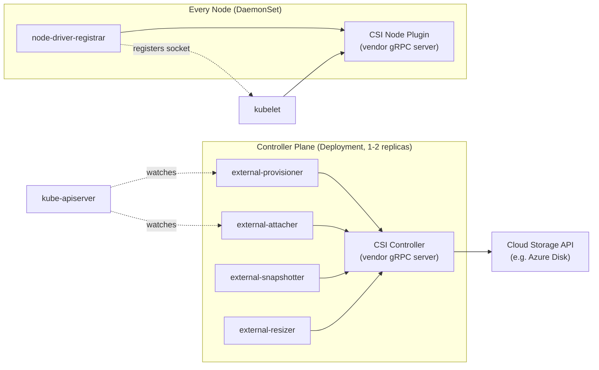
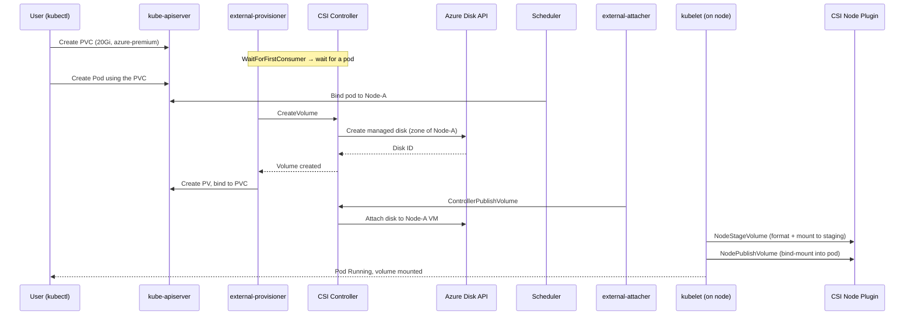
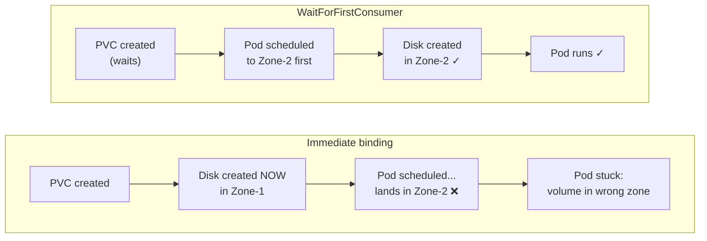

If you've ever run `kubectl apply` on a `PersistentVolumeClaim` and watched a cloud disk magically appear, attach to the right node, and mount into your pod — you've watched a **CSI driver** do its job. Most engineers treat that magic as a black box. This post opens the box.

By the end you'll understand exactly what happens between "I want 20Gi of storage" and "my Postgres container is writing to a mounted volume," why Kubernetes storage is architected the way it is, and how to configure and debug it on a real cluster using **Azure Disk** as the concrete example.

## The problem CSI was born to solve

In the early days, every storage backend — AWS EBS, GCE PD, Azure Disk, Ceph, NFS — had its volume logic compiled **directly into the Kubernetes core binary**. These were called **in-tree plugins**, and they were a disaster for everyone involved:

- **Vendors were hostage to the Kubernetes release cycle.** Want to fix a bug in the Azure Disk plugin? Get a PR merged into `kubernetes/kubernetes`, wait for the next quarterly release, and hope nobody's cluster broke.
- **The core binary kept bloating.** Every cloud's SDK, every edge case, every credential-handling quirk lived in the same tree that ran your scheduler and API server.
- **Security blast radius was enormous.** A vulnerability in one storage plugin was a vulnerability in Kubernetes itself.

The **Container Storage Interface (CSI)** fixed this by doing what good systems engineering always does: it defined a **contract** and moved the implementations behind it. Kubernetes speaks one standard gRPC interface; every storage vendor ships an independent driver that implements it. The same interface works for Kubernetes, Nomad, Mesos, and Cloud Foundry — CSI is deliberately orchestrator-agnostic.

> The mental model: CSI is to storage what CNI is to networking and CRI is to container runtimes. Kubernetes stops caring *how* storage works and only cares that the driver answers the phone when called.

## The gRPC contract at the heart of it

A CSI driver is, at its core, a gRPC server that implements three service interfaces. You don't need to memorize every RPC, but knowing the shape of the contract makes everything downstream click.

| Service | Runs where | Key RPCs | Responsibility |
|---|---|---|---|
| **Identity** | Everywhere | `GetPluginInfo`, `Probe`, `GetPluginCapabilities` | "Who am I, am I healthy, what can I do?" |
| **Controller** | Central (one place) | `CreateVolume`, `DeleteVolume`, `ControllerPublishVolume`, `CreateSnapshot`, `ControllerExpandVolume` | Talks to the **cloud API** — create/delete/attach disks |
| **Node** | Every node | `NodeStageVolume`, `NodePublishVolume`, `NodeUnstageVolume`, `NodeGetInfo` | Does the **on-machine** work — format, mount, bind-mount |

The crucial insight is the **Controller vs Node split**. Creating an Azure Disk is a control-plane operation — you call the Azure API once, from anywhere. But *mounting* that disk has to happen on the specific physical node where the pod landed, because that's where the kernel, the block device, and the filesystem live. CSI separates these two concerns cleanly, and that separation drives the entire deployment topology.

## How a driver is actually deployed

A CSI driver isn't one thing you install — it's **two workloads plus a set of Kubernetes-maintained sidecars** that translate Kubernetes events into gRPC calls.



The **sidecars are not written by the storage vendor** — they're maintained by the Kubernetes storage SIG and shipped as standard images. Their whole job is to watch Kubernetes objects and translate them into CSI gRPC calls:

- **`external-provisioner`** watches for new `PVC`s and calls `CreateVolume`.
- **`external-attacher`** watches `VolumeAttachment` objects and calls `ControllerPublishVolume`.
- **`external-snapshotter`** watches `VolumeSnapshot`s and calls `CreateSnapshot`.
- **`external-resizer`** watches for PVC size changes and calls `ControllerExpandVolume`.
- **`node-driver-registrar`** runs alongside the node plugin and registers its Unix socket with kubelet so kubelet knows which driver handles which volumes.

This is the elegant part: the vendor writes a relatively thin gRPC server, and the sidecars provide all the Kubernetes-native glue. It's the same pattern whether you're on Azure, AWS, or a homelab Ceph cluster.

## The full lifecycle, end to end

Now the payoff. Let's trace exactly what happens when you create a PVC and a pod that uses it. Here's the sequence, and then we'll walk each step.



**Step 1 — PVC created.** You apply a `PersistentVolumeClaim` referencing a `StorageClass`. With `WaitForFirstConsumer` binding (more on that below), nothing happens yet — Kubernetes deliberately waits.

**Step 2 — Pod created and scheduled.** The scheduler places the pod on a node. *Now* Kubernetes knows which node (and therefore which availability zone) the volume needs to live in.

**Step 3 — Provisioning.** `external-provisioner` sees the pending PVC and calls `CreateVolume` on the controller. The controller calls the **Azure Disk API** to create a managed disk — critically, **in the same zone as the scheduled node**.

**Step 4 — PV binding.** The provisioner creates a `PersistentVolume` object representing the new disk and binds it to your PVC. `kubectl get pvc` now shows `Bound`.

**Step 5 — Attach.** `external-attacher` sees the pod needs the volume on Node-A and calls `ControllerPublishVolume`. The controller calls Azure to **attach the managed disk to the node's VM**. The disk now shows up as a block device (e.g. `/dev/sdc`) inside the VM.

**Step 6 — Stage (`NodeStageVolume`).** kubelet calls the **node plugin** to format the raw block device (if it's new) with the requested filesystem (ext4/xfs) and mount it to a **global staging path** — one mount per volume per node, shared across pods that use it.

**Step 7 — Publish (`NodePublishVolume`).** Finally, kubelet calls `NodePublishVolume` to **bind-mount** from the staging path into the pod's specific mount path. Your container starts, and it's writing to a real Azure disk.

The beauty is that each arrow is a single, well-defined gRPC call. When storage breaks, you can pinpoint *which* call failed and know exactly which component to inspect.

## Configuring it on Azure — the StorageClass

Enough theory. Here's how you actually wire this up. First, install the driver (Azure-managed AKS clusters can enable it as an add-on, or you install the upstream chart):

```bash
helm repo add azuredisk-csi-driver \
  https://raw.githubusercontent.com/kubernetes-sigs/azuredisk-csi-driver/master/charts
helm install azuredisk-csi-driver azuredisk-csi-driver/azuredisk-csi-driver \
  --namespace kube-system \
  --set controller.replicas=2
```

The driver authenticates to Azure via the cluster's **managed identity** (or a service principal), so it can call the Azure Disk API without you handing it static credentials.

Now the `StorageClass` — this is the object that tells the provisioner *how* to create disks:

```yaml
apiVersion: storage.k8s.io/v1
kind: StorageClass
metadata:
  name: azure-premium
provisioner: disk.csi.azure.com          # the CSI driver name
parameters:
  skuName: Premium_LRS                    # passed VERBATIM to the Azure API
  cachingMode: ReadOnly
  fsType: ext4
volumeBindingMode: WaitForFirstConsumer   # zone-aware scheduling
allowVolumeExpansion: true                 # enable online resize
reclaimPolicy: Delete                      # delete the disk when the PVC is gone
```

The key thing to internalize: **everything under `parameters` is opaque to Kubernetes.** Kubernetes doesn't know what `skuName: Premium_LRS` means — it just forwards those key-value pairs straight to the driver, which forwards them to the Azure Disk API. That's why the CSI spec scales to every vendor: the `parameters` block is a passthrough.

And the PVC that consumes it:

```yaml
apiVersion: v1
kind: PersistentVolumeClaim
metadata:
  name: postgres-data
spec:
  accessModes: ["ReadWriteOnce"]
  storageClassName: azure-premium
  resources:
    requests:
      storage: 20Gi
```

## The trap that bites everyone: WaitForFirstConsumer

This single setting is responsible for more "why won't my pod schedule?" incidents than almost anything else in Kubernetes storage.



Azure managed disks are **zonal** — a disk in `zone-1` can only attach to a VM in `zone-1`. With `volumeBindingMode: Immediate`, the provisioner creates the disk the moment the PVC appears, picking a zone with no knowledge of where the pod will run. If the scheduler then places the pod in a different zone, you get a permanently unschedulable pod: the disk is in the wrong place and can never attach.

`WaitForFirstConsumer` fixes this by **delaying provisioning until the scheduler has chosen a node.** Only then does the provisioner create the disk — in the correct zone, guaranteed. On any multi-zone cluster, this should be your default.

## Access modes: the Azure Disk gotcha

CSI volumes declare which access modes they support, and Azure Disk supports exactly one that matters:

- **`ReadWriteOnce` (RWO)** — mountable read-write by a single node. This is all Azure Disk offers, because a block device fundamentally can't be safely attached to multiple VMs at once.

If you need **`ReadWriteMany` (RWX)** — multiple pods across multiple nodes writing the same volume (shared uploads, a CMS media folder) — a block-storage disk is the wrong primitive. You switch to a **file** driver: **Azure Files CSI** (`file.csi.azure.com`), which is backed by SMB/NFS shares and supports RWX natively. Same CSI machinery, different provisioner and backing service.

## Resizing and snapshots

Two more lifecycle operations round out a production storage story.

**Online expansion.** With `allowVolumeExpansion: true`, you just edit the PVC's requested size:

```bash
kubectl patch pvc postgres-data -p \
  '{"spec":{"resources":{"requests":{"storage":"50Gi"}}}}'
```

`external-resizer` sees the change, calls `ControllerExpandVolume` (Azure grows the disk), and then `NodeExpandVolume` grows the filesystem — often without a pod restart. Note: Azure Disk supports **growing only**, never shrinking.

**Snapshots.** The snapshot flow mirrors provisioning. You create a `VolumeSnapshot`, `external-snapshotter` calls `CreateSnapshot`, and Azure takes a disk snapshot. To restore, you create a new PVC with a `dataSource` pointing at the snapshot:

```yaml
apiVersion: v1
kind: PersistentVolumeClaim
metadata:
  name: postgres-restore
spec:
  storageClassName: azure-premium
  dataSource:
    name: postgres-snapshot
    kind: VolumeSnapshot
    apiGroup: snapshot.storage.k8s.io
  accessModes: ["ReadWriteOnce"]
  resources:
    requests:
      storage: 20Gi
```

The provisioner sees the `dataSource` and, instead of creating a blank disk, tells Azure to **create the disk from the snapshot**. Instant point-in-time recovery.

## Debugging CSI when it breaks

Because every step is a discrete gRPC call, failures are localized. The most common ones and where to look:

- **PVC stuck in `Pending`** → provisioning failed. Check `external-provisioner` logs and the PVC events (`kubectl describe pvc`). Usually a bad `StorageClass` parameter or a cloud quota/permission issue.
- **`FailedAttachVolume` / `FailedMount`** → attach failed. Check the `VolumeAttachment` object and `external-attacher` logs. On Azure, a frequent cause is the **per-VM disk attach limit** — each VM size caps how many data disks it can hold, and hitting it wedges scheduling.
- **Pod stuck at `ContainerCreating` with a mount error** → the node plugin's `NodeStageVolume`/`NodePublishVolume` failed. Check the node plugin DaemonSet logs on that specific node — often a filesystem or device-path issue.

The single most valuable habit: `kubectl describe` the PVC and the pod first. The events there almost always name the exact CSI phase that failed, which tells you which of the components above to go read logs from.

## The one-sentence mental model

For interviews and 3 AM incidents alike, this is the chain to keep in your head:

> A **StorageClass** defines *how* to make storage → a **PVC** requests it → the **external-provisioner** calls the driver's **CreateVolume** to create a cloud disk → the **external-attacher** calls **ControllerPublishVolume** to attach it to the node → **kubelet** calls the node plugin's **NodeStage/NodePublish** to format and mount it into the pod.

Everything else — snapshots, resizing, RWX vs RWO, zone-awareness — is a variation on that spine. Once the spine is solid, the rest is detail.
