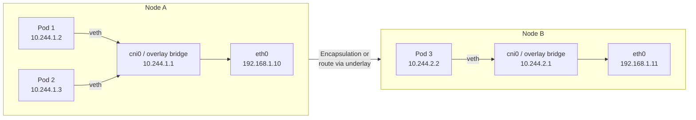
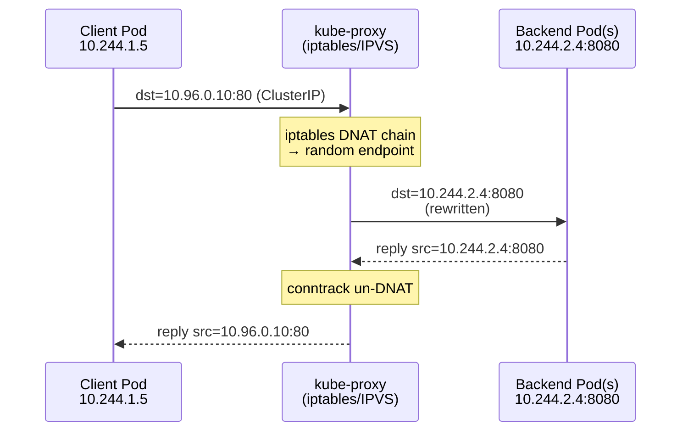
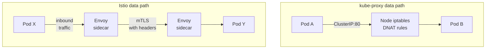
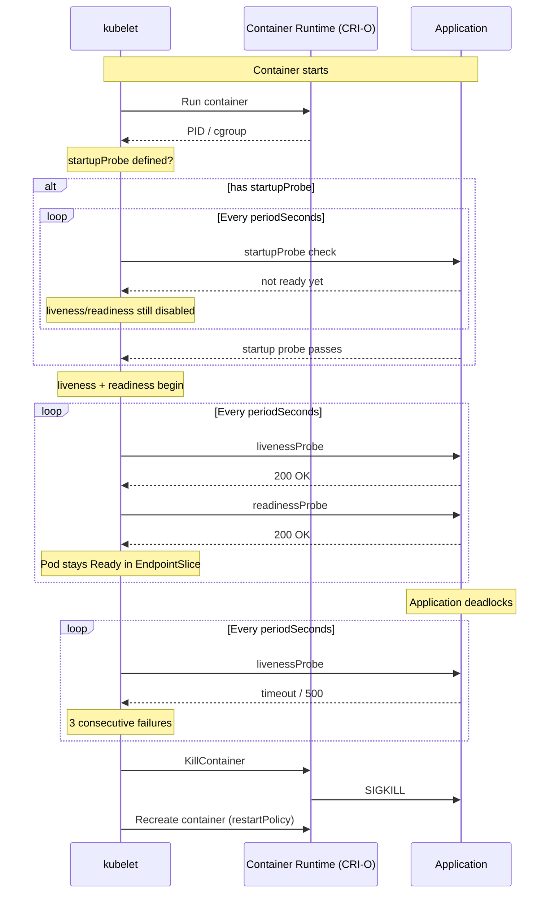
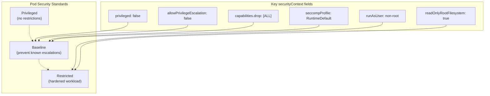
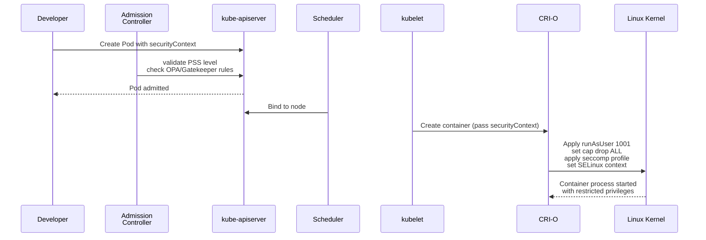
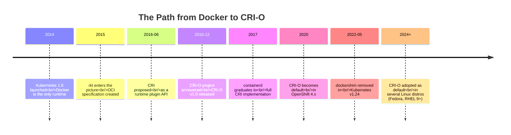
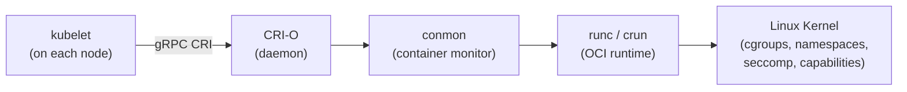

If you work with Kubernetes day to day, you've touched all five of these subjects — but probably never in one sitting. This post connects them into a single narrative: **how a packet enters the cluster, gets routed to a pod, is health-checked, secured, and finally run by a container runtime that was built specifically for this moment.**

We'll start at the network layer, move up the stack through services and service meshes, inspect the probes that keep pods alive, lock down the workload with security contexts, and end with the runtime that makes it all possible — CRI-O, from its Kubernetes CRI origins to its place in the modern ecosystem.

---

## 1. Networking in Kubernetes: The Model and Its Mechanisms

Kubernetes makes four strong promises about networking — and the entire ecosystem of CNI plugins, kube-proxy, and service meshes exists to uphold them.

### The four axioms

The Kubernetes networking model, first codified in the 2014 design documents and refined through v1.0 (July 2015), rests on four rules:

1. **Every pod gets its own IP address** — cluster-wide, unique, and routable.
2. **Every pod can reach every other pod directly** — no NAT, no proxy, across any node.
3. **Every node can reach every pod on that node and every other node.**
4. **Communication from a pod to itself via `localhost` addresses its own containers** — the pod shares a network namespace (via the `pause` container).

These rules deliberately mirror the "flat network" model of VMs on a LAN, making it easy to lift on-prem applications into containers without rewriting network logic.

### How the flat network is implemented

The model is *what*; the CNI (Container Network Interface) is *how*. When a pod lands on a node, kubelet calls the CNI plugin's binary, passes it the pod's network namespace and a JSON configuration, and the plugin wires up one end of a veth pair inside the pod and the other end onto a bridge or an overlay.



Each CNI plugin answers the same question differently:

- **Flannel** (2014, CoreOS) — the simplest: VXLAN overlay. Each pod gets a `/24` subnet on its node; cross-node traffic is encapsulated in UDP packets over the host network. Simple, low CPU, moderate throughput overhead (~5–10%).
- **Calico** (2015, Tigera) — pure L3 routing with BGP. No overlay. Every node peers with its neighbors (or a route reflector) and announces pod subnet routes. High throughput, low latency, and built-in network policy via iptables/eBPF.
- **Cilium** (2017, Isovalent) — eBPF-based. Replaces iptables with BPF programs attached to the kernel's TC and XDP hooks. Offers L3–L7 policies, transparent encryption, and Hubble observability. Sub-millisecond latency and 2–3× throughput vs iptables-based policies.
- **Weave Net** — mesh overlay with fast datapath via Open vSwitch.
- **Amazon VPC CNI** — assigns each pod a real VPC IP from the subnet, bypassing overlays entirely. Fast, but exhausts IPs faster.

### kube-proxy: the Service abstraction

Without Services, pods are ephemeral — their IPs change on restart, and you can't load-balance across replicas. kube-proxy (running as a DaemonSet on every node since v1.0) watches the API server for Service and EndpointSlice objects and programs NAT rules to redirect traffic from a stable **ClusterIP** to the current set of healthy pod IPs.

kube-proxy has three modes:

| Mode | Mechanism | Latency | Throughput | Complexity |
|------|-----------|---------|------------|------------|
| **userspace** (legacy, removed in v1.26) | Userspace proxy listening on each ClusterIP | High (kernel↔userspace round-trip) | Low | Simple |
| **iptables** (default through v1.28) | `PREROUTING`/`OUTPUT` DNAT chains updated by `iptables-restore` | ~O(n) per packet as rules are traversed linearly | Degrades with rule count (~1000 rules → 5–10µs per packet) | Moderate |
| **IPVS** (GA since v1.11) | Netfilter's IPVS kernel module with O(1) hash lookup | ~1µs per packet regardless of rule count | High, scales to 10k+ services | Requires `ipvsadm`, kernel module `ip_vs` |

The mental model: **kube-proxy turns a virtual IP (the ClusterIP) into concrete DNAT rules.** That's the entire Service abstraction in one sentence.



### The limits of kube-proxy

kube-proxy is a triumph of simplicity — it's a single binary, no stateful storage, no sidecars. But it only operates at **L4 (TCP/UDP/SCTP)**. It can't:

- Route based on HTTP path, headers, or method.
- Retry failed requests or apply circuit breakers.
- Provide mTLS between pods.
- Emit detailed L7 metrics (request latency percentiles, error rates by route).
- Implement canary or blue-green routing based on header inspection.

These limits are not bugs — they're design choices. kube-proxy solves the *cluster-internal load-balancing* problem with minimal overhead. For anything above L4, you enter the territory of the **service mesh**.

---

## 2. If kube-proxy Already Exists, Why Istio?

This is the single most common question from engineers learning Kubernetes networking, and the answer is **layers of abstraction**.

kube-proxy solves the **"how do I reach a pod"** problem. Istio (and Envoy-based meshes generically) solves the **"how do I reach a pod with security, reliability, and observability guarantees"** problem. They are not alternatives — they are complements that operate at different layers of the OSI model.

### What kube-proxy cannot do (and Istio can)

| Capability | kube-proxy | Istio |
|------------|------------|-------|
| Load-balancing | Random/round-robin per connection (L4) | Weighted, locality-aware, least-request, consistent-hash (L7) |
| Traffic routing | None | Header-based, path-based, mirroring, canary, fault injection |
| mTLS | None | Automatic, with SPIFFE identities; rotation and revocation |
| Circuit breaking | None | Outlier detection, passive and active health checking |
| Observability | `conntrack -L` counters | Per-request latency, error rate, traffic graph (Kiali), distributed tracing |
| Retries / timeouts | None | Configurable per route |
| Access control | NetworkPolicy (L3/L4) | L7 policies (RBAC, JWT validation, OPA integration) |

### The architectural difference

kube-proxy is a **node-level** component — one DaemonSet process that modifies netfilter rules on each machine. It operates in the **kernel** data path.

Istio is a **sidecar mesh** — an Envoy proxy injected as a sidecar container into every pod, intercepting all traffic via iptables rules installed by `istio-init`. The key insight: each pod gets its own dedicated proxy, so the data plane is distributed within the pod, not centralized at the node.



The iptables rules installed by Istio (`istio-iptables`) redirect the pod's entire traffic through the Envoy sidecar. Envoy then applies L7 routing, mTLS, telemetry, and policy — and when the destination is reached, the **destination Envoy** decrypts mTLS and forwards the plaintext request to the local application container.

### Wait — don't both L3/L4 rules and L7 proxies run? Yes.

When Istio is installed, kube-proxy still runs. Services still get ClusterIP DNAT rules. But the traffic flow becomes:

1. Client pod sends to `ClusterIP:80`. The source pod's iptables (Istio's) **intercept before** the kernel routes to the DNAT target. The packet goes to the local Envoy instead.
2. Envoy resolves the destination, applies routing rules, and establishes an **mTLS connection** to the destination pod's Envoy.
3. Destination Envoy decrypts and forwards to the application container.

The original kube-proxy DNAT rules never fire for mesh traffic — Istio's intercept rules have higher priority in the iptables chain.

### When should you use Istio?

Use kube-proxy alone when: simple round-robin L4 balancing is enough, you don't need mTLS (your network is already trusted or uses a CNI with encryption), and observability at the connection level satisfies your requirements.

Add Istio when: you need L7 routing (canary deployments, A/B testing, header-based routing), mutual TLS between every service, detailed per-request observability, or circuit breakers and retries to improve resilience against partial failures.

The cost is complexity — each request now traverses two Envoy proxies, adds ~2–5ms of latency on the p99, and consumes additional CPU/memory per pod (Envoy's idle resource usage is ~50–100MB per sidecar + ~0.5–1 vCPU under load).

---

## 3. Liveness and Readiness Probes

Probes are Kubernetes's mechanism for asking the runtime question: **is this container actually working?** They were introduced in Kubernetes v1.0 (alongside the Pod API) and refined with `startupProbe` in v1.16.

### The three probe types

| Probe | When it runs | What it means | What happens on failure |
|-------|-------------|---------------|------------------------|
| **Liveness** | Throughout the container's life | "Is the application still running and not deadlocked?" | kubelet kills the container and restarts it (per `restartPolicy`) |
| **Readiness** | Throughout the container's life | "Is the application ready to serve traffic?" | Pod is removed from all Service EndpointSlices — no traffic is routed |
| **Startup** | Only during container startup | "Has the application finished starting?" | A failing startup probe delays liveness and readiness probes from running |

The **startup probe** exists precisely to fix the "slow boot" problem. A Java application that takes 90 seconds to start would fail its 10-second-interval liveness probe 9 times and get killed. With a startup probe, kubelet *defers* the liveness/readiness checks until the startup probe succeeds — and gives it a generous failure threshold.

### How probes work, precisely

Each probe is one of three handlers:

**HTTP GET probe:**
```yaml
livenessProbe:
  httpGet:
    path: /healthz
    port: 8080
    httpHeaders:
      - name: X-Health-Check
        value: k8s-probe
  initialDelaySeconds: 5
  periodSeconds: 10
  timeoutSeconds: 3
  failureThreshold: 3
  successThreshold: 1
```

kubelet sends an HTTP GET to `http://POD_IP:8080/healthz`. Any response code >= 200 and below 400 is success; anything else (including connection refused, timeout, or 5xx) is failure.

**TCP socket probe:**
```yaml
livenessProbe:
  tcpSocket:
    port: 3306
  periodSeconds: 15
```

kubelet attempts a TCP connect to the specified port. Connection established = success. The probe doesn't send any data — it's a pure connectivity check, useful for services that speak binary protocols and don't have an HTTP endpoint.

**gRPC probe** (alpha in v1.24, beta in v1.27):
```yaml
livenessProbe:
  grpc:
    port: 50051
    service: "grpc.health.v1.Health"
```

kubelet calls the standard gRPC health checking protocol. Requires the application to implement `grpc.health.v1.Health/Check`. No HTTP translation layer needed.

**Exec probe:**
```yaml
livenessProbe:
  exec:
    command:
      - /bin/check_app.sh
```

kubelet runs the command *inside the container*. Exit code 0 = success, anything else = failure. Most flexible, but requires the app or a companion script to be present in the container image.

### The coordination mechanism



### The throttling behavior that surprises people

A critical implementation detail: if a probe response takes longer than `timeoutSeconds`, kubelet records the probe as failed *and also* resets its internal timer — meaning the next probe fires `periodSeconds` after the timeout, not `periodSeconds` after the *scheduled* time. Under load, this means probes can **drift apart**, leading to cascading failures where a slow backend causes every node's probes to pile up. Keep `timeoutSeconds` well below `periodSeconds` (3s vs 10s is a good ratio).

### Common patterns

- **Separate /healthz (liveness) from /ready (readiness).** Liveness checks the process itself — is the goroutine pool alive, is the DB connection pool not exhausted? Readiness checks whether the process can serve traffic *right now* — is the backing cache warm? Is there a leader lease? A process can be alive but not ready (e.g., during a rolling restart).
- **Use startup probes for containers with longer than 30s boot time.** Set `failureThreshold: 30` with `periodSeconds: 10` to give a 5-minute startup window before liveness kicks in.
- **Do not use liveness probes as a crash-recovery hammer.** If your application reliably crashes on bad input, let the OS kill it — a liveness probe that runs every 5 seconds across hundreds of pods is wasted API server and kubelet CPU. Reserve liveness for *deadlock detection*, not crash recovery.

---

## 4. Security Contexts in Kubernetes

Security contexts are the primary building block for **least-privilege workload execution** in Kubernetes. They were introduced in v1.0 as `PodSecurityContext` and later extended with container-level `SecurityContext` and `SecurityContextConstraints` (OpenShift). At the OS level, every process runs with certain privileges — a UID, GID, Linux capabilities, seccomp profile, AppArmor/SELinux labels. By default, containers in Kubernetes inherit the host's security posture, which is almost always too permissive. Security contexts let you **tighten that posture** per pod and per container.

### Pod-level vs container-level

```yaml
apiVersion: v1
kind: Pod
metadata:
  name: hardened-app
spec:
  securityContext:               # pod-level — applies to ALL containers
    runAsUser: 1000
    runAsGroup: 3000
    fsGroup: 2000
    supplementalGroups: [4000]
    seLinuxOptions:
      level: "s0:c123,c456"
    sysctls:
      - name: net.ipv4.tcp_syncookies
        value: "0"
  containers:
    - name: app
      image: my-app:1.0
      securityContext:           # container-level — OVERRIDES pod-level
        runAsUser: 1001          # this container runs as UID 1001, not 1000
        capabilities:
          add: ["NET_ADMIN"]
          drop: ["ALL"]
        allowPrivilegeEscalation: false
        readOnlyRootFilesystem: true
        privileged: false
        seccompProfile:
          type: RuntimeDefault
        procMount: Default
```

The pod-level security context is a *baseline*. Each container can override specific fields, but some fields (like `seLinuxOptions`) are per-pod. The priority is: **container > pod > runtime defaults > kernel defaults**.

### The critical fields, explained

**`runAsUser` / `runAsGroup`** — The numeric UID/GID the container's entrypoint process runs as. Default is root (0), which is the single biggest container security risk. Running as non-root prevents the container from modifying system binaries, installing packages, or escaping to the host via CVE exploits. **Every production image should set this.**

**`fsGroup`** — When set, kubelet recursively `chown`s volumes mounted into the pod to this GID. Without it, a non-root container may lack write permissions on a volume owned by root. Essential for stateful workloads.

**`capabilities`** — Linux divides root's privileges into ~40 distinct capabilities (`CAP_NET_ADMIN`, `CAP_SYS_TIME`, etc.). By default, Docker and CRI-O grant a bounded set. The pattern is:
```yaml
capabilities:
  drop: ["ALL"]
  add: ["NET_BIND_SERVICE"]   # allow binding to ports below 1024
```
Drop everything, then add back only what's needed. This is the **principle of least privilege** applied to kernel capabilities.

**`allowPrivilegeEscalation`** — When `true` (default on many runtimes), the container's process can gain additional privileges beyond its parent (via setuid binaries, `sudo`, etc.). **Should always be `false`** unless you specifically need it, and then you should audit why.

**`privileged`** — Grants the container all capabilities and lifts all restrictions. The container essentially runs as root on the host. Avoid in production. Kubernetes audits detect it and many admission controllers (OPA, Kyverno) block it by policy.

**`readOnlyRootFilesystem`** — Mounts the container's root filesystem as read-only. Forces the application to write to a separate ephemeral volume (`emptyDir`) or a persistent volume. Prevents attackers from modifying binaries, libraries, or shell scripts inside the container even if they gain code execution.

**`seccompProfile`** — The Linux seccomp (secure computing mode) BPF filter restricts which system calls a process can make. Kubernetes supports three profiles:
- `RuntimeDefault` — lets the runtime (CRI-O, containerd) apply its own seccomp profile (typically the Docker/default profile, which allows ~300 of ~450 syscalls).
- `Localhost` — a custom JSON profile loaded from the node's filesystem.
- `Unconfined` — no restriction (**not recommended**).

Since Kubernetes v1.27, the seccomp profile defaults to `RuntimeDefault` for new deployments (previously it was `Unconfined`, which was a major security gap).

### How security contexts compose with Pod Security Standards

Kubernetes defines three **Pod Security Standard (PSS)** levels, enforced by the `PodSecurity` admission controller (replacing the deprecated PSP in v1.25):

| Level | Description | Example `securityContext` |
|-------|-------------|---------------------------|
| **Privileged** | Unrestricted. Intentionally open. | `privileged: true`, all capabilities, no seccomp |
| **Baseline** | Minimal restrictions to prevent known escalations. | `allowPrivilegeEscalation: false`, `privileged: false`, `capabilities.drop: ["ALL"]`, seccomp: RuntimeDefault |
| **Restricted** | Hardened, following Pod Security Standards best practices. | All of Baseline + `runAsUser: non-root` (fixed or range), `seccomp: RuntimeDefault`, `capabilities.drop: ["ALL"]`, `readOnlyRootFilesystem: true`, `seccompProfile: RuntimeDefault` |



### How SecurityContext works with the broader Kubernetes security model

Security contexts do not operate in isolation. They fit into a stack:

1. **Node security** — the host OS is hardened (CIS benchmarks, minimal userspace, kernel lockdown mode).
2. **Container runtime** — CRI-O or containerd enforce seccomp, AppArmor/SELinux profiles.
3. **Security context** — per-workload privilege settings inside the pod spec.
4. **Pod Security Admission / OPA/Gatekeeper** — admission controllers that *deny* pods that violate cluster-wide security policies.
5. **NetworkPolicy** — L3/L4 firewall rules between pods.
6. **RBAC** — who can create pods, attach to them, exec into them.
7. **mTLS (Istio / Cilium)** — encrypts traffic between pods.



### The `mustRunAsNonRoot: true` pattern

For organizations that want to guarantee no container runs as root, set:

```yaml
apiVersion: v1
kind: Pod
spec:
  securityContext:
    runAsNonRoot: true
```

kubelet (in v1.8+) blocks the container from starting if the container image's entrypoint UID is 0. This is **image-independent** — it doesn't matter what `FROM` statement the Dockerfile used; if the container tries to run as root, it fails. This is the single most impactful security context field because it catches misconfigured images that forget to `USER 1000`.

---

## 5. CRI-O: The Container Runtime Built for Kubernetes

### The historical problem

In the beginning (2014–2015), Kubernetes managed containers by calling the Docker API directly through a component called **dockermanager**. This worked, but it created a hard dependency on Docker's specific version, API, and CLI. When Docker, Inc. announced the container runtime **rkt** (pronounced "rocket") as a competitor, the Kubernetes community realized they needed a **plugin interface**, not an SDK dependency.

### The CRI specification

In June 2016, the **Container Runtime Interface (CRI)** was proposed — a protobuf-based gRPC API that defined exactly how kubelet communicates with a container runtime. The contract has two services:

- **`RuntimeService`** — `RunPodSandbox`, `StopPodSandbox`, `CreateContainer`, `StartContainer`, `StopContainer`, `RemoveContainer`, `Status`, `ListContainers`, etc.
- **`ImageService`** — `PullImage`, `ListImages`, `RemoveImage`, `ImageStatus`.

Any runtime implementing this gRPC contract can run Kubernetes containers. Docker didn't implement CRI natively — instead, a shim called **dockershim** translated CRI calls into Docker API calls, living inside the Kubernetes source tree as a temporary bridge. That temporary bridge lasted from Kubernetes v1.5 (December 2016) until v1.24 (May 2022), when dockershim was finally removed, forcing adopters onto CRI-compliant runtimes.



### CRI-O's place in the stack

CRI-O is a **CRI implementation** that uses **OCI-compatible runtimes** (runc, crun, youki) to run containers. It was created by Red Hat in 2016 (initial commit: December 2016) specifically to be the **lightest possible path** between kubelet and the Linux kernel — no Docker daemon, no dockershim, no extraneous features.



The architecture is deliberately minimal:

1. **kubelet** sends a CRI request (e.g., `RunPodSandbox` with a pod spec) to CRI-O over a Unix socket (`/var/run/crio/crio.sock`).
2. **CRI-O** translates the request into OCI bundle generation: it downloads the image (via containers/image), creates the container configuration (cgroups, seccomp, SELinux labels, mount namespaces), and writes an OCI-compliant bundle to the filesystem.
3. **conmon** — a tiny C program (~500 lines) — monitors the container's lifecycle. It holds the container's PTY, tracks its exit code, and reports it back to CRI-O. conmon is what makes `kubectl logs -f` work — it reads from a pipe connected to the container's stdout.
4. **runc / crun** — the OCI runtime — receives the bundle and calls `clone(2)` with the appropriate namespaces, cgroups, and seccomp filters to create the container process.
5. The **Linux kernel** enforces the isolation: namespaces for PID, network, mount; cgroups for CPU/memory limits; seccomp for syscall filtering; SELinux/AppArmor for MAC.

### CRI-O vs containerd

These are the two dominant CRI implementations. They do the same job — implement CRI over OCI — but with different design philosophies:

| Aspect | CRI-O | containerd |
|--------|-------|------------|
| **Origin** | Red Hat, 2016 | Docker, Inc., 2017 (graduated from Docker engine) |
| **Codebase** | Pure Go, ~80K LOC | Go + C (for runc), ~200K LOC |
| **Dependencies** | Minimal — no Docker libraries | Shares some Docker/Moby libraries |
| **Image management** | `containers/image` (library) | Built-in image store |
| **CLI tool** | `crictl` (shared with containerd), `crioctl` | `crictl`, `ctr` (containerd's own) |
| **Default in** | OpenShift, Fedora CoreOS, RHEL | GKE, EKS (default), AKS |
| **SELinux support** | First-class — SELinux labels on every pod | Supported but less tightly integrated |
| **Kubernetes release cadence** | Released in lockstep with Kubernetes | Independent release cycle |
| **kubelet integration** | Direct by design | Direct by design |
| **Pod overhead** | ~10–15MB per pod (crio + conmon) | ~15–20MB per pod |

### CRI-O's signature features

**SELinux integration.** On Red Hat systems, CRI-O assigns a unique SELinux MCS (Multi-Category Security) label to every pod sandbox — `s0:c<random>,c<random>`. This prevents container breakouts: even if a process escapes one container, SELinux blocks it from writing to another container's files or the host's system files because the labels don't match.

**Pinned image garbage collection.** CRI-O's image GC understands which images are in use by running containers (via pinned references) and will never delete an in-use layer — a problem that caused pod restarts in containerd when GC aggressively pruned shared image layers.

**CRIU (Checkpoint/Restore).** CRI-O supports checkpoint and restore of containers via CRIU (`criu`), allowing live migration of pods between nodes — an essential feature for cluster autoscaler and node-drain scenarios.

### The conmon edge

conmon deserves special attention because it's one of the most elegant pieces of the CRI-O architecture. Before CRI-O, kubelet had to interact directly with Docker to get container logs, exit codes, and process signals. conmon runs as a child of the CRI-O daemon's process tree and holds the container's:

- **stdout/stderr pipes** — for `kubectl logs`.
- **PID file** — for tracking container lifecycle.
- **Exit code file** — written atomically when the container exits.
- **Signal forwarding** — kubelet sends `SIGTERM` → CRI-O → conmon sends it to the container's init process.

Because conmon is a separate C process (not Go), it avoids the GC and scheduling latency of the Go runtime for time-sensitive operations like signal delivery and exit-code collection.

### Why CRI-O matters today

dockershim's removal in Kubernetes v1.24 was the inflection point. Every cluster running Kubernetes v1.24+ uses a CRI-compliant runtime. CRI-O's position as the purest CRI implementation — no Docker baggage, no additional features beyond what Kubernetes needs — makes it the runtime of choice for:

- **Red Hat OpenShift** (CRI-O is the default and only supported runtime).
- **Fedora CoreOS / RHEL** — `cri-o` is the default container runtime.
- **Single-purpose Kubernetes clusters** (edge, IoT, telco) where minimal overhead and a narrow attack surface outweigh ecosystem breadth.
- **SELinux-mandated environments** (government, defense, financial) where container isolation must be verified with mandatory access controls.

### The mental model for the runtime chain

> A pod spec from the API server becomes a seccomp-filtered, SELinux-labeled, cgroup-bounded Linux process with CRI-O translating each CRI call into an OCI bundle, conmon watching the pipes, and runc/crun making the final `clone(2)` call into kernel namespaces.

Every component in this chain — kubelet → CRI-O → conmon → runc → kernel — was designed with the same philosophy: **do one thing, do it for Kubernetes, do it with the minimum moving parts.** That philosophy is why CRI-O went from a Red Hat experiment in December 2016 to the default runtime for tens of thousands of production clusters.

---

## Putting It All Together

A single pod request from `kubectl apply -f pod.yaml` touches every layer we've discussed:

1. **Network** — the CNI plugin assigns an IP, configures routing, and ensures L3 reachability.
2. **Services** — kube-proxy translates ClusterIPs to pod IPs via DNAT rules, giving the pod a stable network identity.
3. **Istio** (if installed) — intercepts traffic at L7, applying mTLS, routing rules, and observability.
4. **Probes** — kubelet monitors the pod's health and readiness, keeping it in the service mesh's load-balancing pool.
5. **Security context** — the pod runs as non-root UID 1001, with seccomp restricting syscalls, capabilities dropped to just `NET_BIND_SERVICE`, and SELinux labels preventing cross-container interference.
6. **CRI-O** — receives the CRI request from kubelet, pulls the OCI image, generates the OCI bundle, configures conmon, and hands the bundle to runc for the final `exec`.

That's the full stack — from the packet arriving at the node to the process sandboxed inside the container.

```mermaid
graph TB
    API["kube-apiserver"] -->|Pod spec| SCHED["Scheduler"]
    SCHED -->|Bind| KUBELET["kubelet"]
    KUBELET -->|CRI gRPC| CRIO["CRI-O"]
    CRIO -->|OCI bundle| RUNC["runc / crun"]
    RUNC -->|clone(2) + namespace| KERNEL["Linux Kernel"]
    
    CRIO -->|securityContext| ENF["Enforce seccomp<br/>capabilities<br/>SELinux"]
    KUBELET -->|CNI| CNI_PLUGIN["CNI Plugin<br/>(Calico/Cilium/Flannel)"]
    CNI_PLUGIN -->|veth + bridge| NET_NS["Pod network<br/>namespace"]
    
    KUBELET -->|livenessProbe| HEALTH["Pod health<br/>monitoring"]
    KUBELET -->|readinessProbe| READY["Traffic routing<br/>(EndpointSlice)"]
    
    ISTIO_SIDECAR["Envoy sidecar"] -->|intercept| POD_TRAFFIC["Pod traffic"]
    ISTIO_SIDECAR -->|mTLS + routing| UPSTREAM["Upstream services"]
    
    KUBEPROXY["kube-proxy"] -->|DNAT rules| SERVICE["Service ClusterIP"]
    
    APP_CONTAINER["Application<br/>container"] -->|readOnlyRootFilesystem| FILES["Filesystem"]
```

What makes Kubernetes powerful is not any single technology in this chain — it's the **interfaces** that decouple them. CNI, CRI, CSI, and the Service API each define a contract that vendor implementations can fulfill independently. Understanding how the layers interact turns Kubernetes from a "black box that runs containers" into a comprehensible system where every component has a responsible, well-scoped job.

---

## References

- [Kubernetes Networking Model](https://kubernetes.io/docs/concepts/cluster-administration/networking/)
- [Kubernetes Services and kube-proxy](https://kubernetes.io/docs/concepts/services-networking/service/)
- [Istio Architecture](https://istio.io/latest/docs/ops/deployment/architecture/)
- [Configure Liveness, Readiness and Startup Probes](https://kubernetes.io/docs/tasks/configure-pod-container/configure-liveness-readiness-startup-probes/)
- [Configure a Security Context](https://kubernetes.io/docs/tasks/configure-pod-container/security-context/)
- [Pod Security Standards](https://kubernetes.io/docs/concepts/security/pod-security-standards/)
- [CRI-O GitHub Repository](https://github.com/cri-o/cri-o)
- [Introducing CRI in Kubernetes (Dec 2016)](https://kubernetes.io/blog/2016/12/container-runtime-interface-cri-in-kubernetes/)
- [OCI Specification](https://opencontainers.org/)
- [Kubernetes v1.24: dockershim Removal](https://kubernetes.io/blog/2022/05/03/kubernetes-1-24-release-announcement/)
