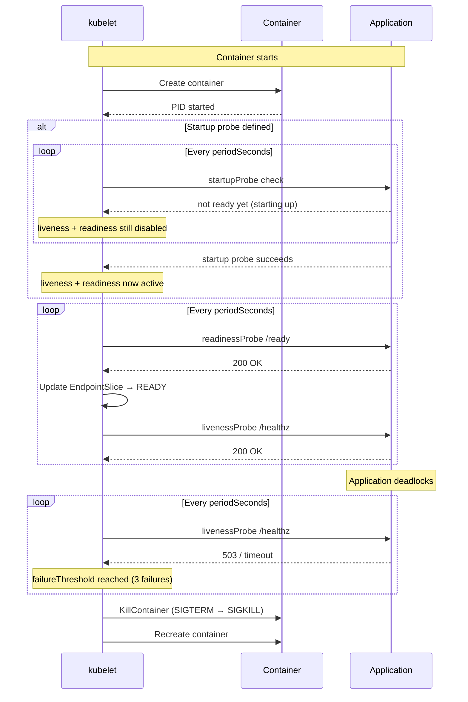

A container process is running. That does not mean the application inside it is healthy. The database connection pool could be exhausted. The application could be deadlocked in a goroutine. The cache might not be warm yet. The process itself is alive — but it can't serve traffic.

This is the fundamental gap that Kubernetes probes exist to fill. They are the mechanism by which kubelet, the node agent, asks a question that has no answer in the kernel: **is this container actually doing useful work?**

---

## The Origin Story

In the earliest versions of Kubernetes (2014–2015), kubelet had a single, crude health metric: was the container process running? If `WaitForProcess` returned an exit code, the container was dead and would be restarted. If the process was alive, the container was "healthy."

This was insufficient for two reasons:

1. **Deadlocks** — a process can be alive in the kernel sense (the PID exists, no signal delivered) while the application inside is completely stuck.
2. **Slow starts** — a Java application takes 60 seconds to warm its JIT compiler, load caches, and open database connections. The process starts immediately, but it's not ready for traffic.

The solution was formalized in Kubernetes v1.0 (July 2015) with two new fields in the Pod spec: `livenessProbe` and `readinessProbe`. A third probe, `startupProbe`, was added in v1.16 (September 2019) to address the slow-start problem more elegantly.

---

## The Three Probes

### LivenessProbe — Is the application still alive?

The liveness probe answers a binary question: **should this container be killed and restarted?**

It runs continuously throughout the container's entire lifetime. If it fails, kubelet kills the container and recreates it according to the Pod's `restartPolicy` (default: `Always`).

```yaml
apiVersion: v1
kind: Pod
metadata:
  name: liveness-demo
spec:
  containers:
    - name: app
      image: my-app:1.0
      livenessProbe:
        httpGet:
          path: /healthz
          port: 8080
        initialDelaySeconds: 10
        periodSeconds: 15
        timeoutSeconds: 3
        failureThreshold: 3
        successThreshold: 1
```

**What it should check:** The core process health — is the event loop running? Is the goroutine pool not deadlocked? Is the database connection pool not exhausted? It should NOT check external dependencies (a downstream Redis, a third-party API) because those failures are transient and killing the container won't fix them.

### ReadinessProbe — Is the application ready to serve traffic?

The readiness probe answers a different question: **should this Pod receive traffic?**

It also runs continuously. When it fails, the Pod is removed from all Service EndpointSlices — no traffic is routed to it. But the container is NOT killed. This is the critical difference from liveness.

```yaml
      readinessProbe:
        httpGet:
          path: /ready
          port: 8080
        initialDelaySeconds: 5
        periodSeconds: 10
        timeoutSeconds: 2
        failureThreshold: 2
        successThreshold: 1
```

**What it should check:** Is the application ready to handle requests right now? Is the cache warm? Has the leader election completed? Is the database migrated? These conditions are transient — the application may become ready again without needing a restart.

### StartupProbe — Has the container finished starting?

The startup probe solves a timing problem. Some applications take a long time to start (JVM warmup, loading ML models, restoring from snapshots). Without a startup probe, a slow-starting application would fail its liveness probe multiple times during boot and get killed before it ever became healthy.

Before startup probes existed, the only solution was to set a large `initialDelaySeconds` on the liveness probe — a crude guess that wasted time when the container started quickly.

```yaml
      startupProbe:
        httpGet:
          path: /healthz
          port: 8080
        initialDelaySeconds: 0
        periodSeconds: 5
        timeoutSeconds: 3
        failureThreshold: 30   # 30 × 5s = 150s startup window
        successThreshold: 1
```

**How it works:** When a startup probe is defined, kubelet *disables* the liveness and readiness probes until the startup probe succeeds. This gives the container a generous startup window (configured by `failureThreshold × periodSeconds`) without risking premature killing.

Once the startup probe succeeds, kubelet switches to the liveness and readiness probes for the remainder of the container's life. The startup probe stops running.



---

## The Four Handler Types

Each probe uses one of four handlers to check the container.

### HTTP GET probe

kubelet sends an HTTP GET to `http://POD_IP:port/path`. Any response with status code >= 200 and < 400 is success. Everything else (5xx, 3xx redirects, connection refused, timeout) is failure.

```yaml
livenessProbe:
  httpGet:
    path: /healthz
    port: 8080
    httpHeaders:
      - name: X-Health-Check
        value: k8s-probe
  periodSeconds: 10
  timeoutSeconds: 3
```

**Under the hood:** kubelet creates an `http.Client` with a `Timeout` equal to `timeoutSeconds`. It dials the Pod's IP directly (not through the Service — bypassing kube-proxy), constructs the GET request, sends it, and reads the response body (up to 64KB, immediately discarded). Any error or wrong status code marks the probe as failed.

**Gotcha:** If your application has authentication middleware that requires a bearer token for `/healthz`, the probe needs to either bypass the auth (add `httpHeaders` with the token, or exclude `/healthz` from the auth middleware). A common pattern is to run the health endpoint on a separate port (e.g., `:8081` for health, `:8080` for application traffic) and exclude the health port from authentication.

### TCP socket probe

kubelet attempts a TCP connection to the specified port. Connection established = success. Connection refused or timeout = failure.

```yaml
readinessProbe:
  tcpSocket:
    port: 3306
  periodSeconds: 15
  timeoutSeconds: 3
```

**Under the hood:** kubelet calls `net.DialTimeout("tcp", "POD_IP:port", timeout)`. If the dial succeeds, the connection is immediately closed. kubelet does NOT send any data — it's purely a connectivity check. This means a TCP probe will succeed even if the application behind the port is returning garbage — as long as the TCP handshake completes.

**Best for:** Protocols that don't have an HTTP endpoint or where implementing one is impractical — MySQL, Redis, Postgres, custom binary protocols.

**Gotcha:** A TCP probe only verifies that the port is open. If the application is accepting connections but returning errors on every request, the TCP probe will still report success.

### gRPC probe (alpha in v1.24, beta in v1.27)

Since Kubernetes v1.24, kubelet supports natively calling the standard gRPC health checking protocol (`grpc.health.v1.Health/Check`).

```yaml
livenessProbe:
  grpc:
    port: 50051
    service: "my.health.v1.Health"
  periodSeconds: 10
```

**Under the hood:** kubelet (or the `grpc-health-prober` binary that ships with K8s) sends a `HealthCheckRequest` to the gRPC server. The server must implement the `grpc.health.v1.Health` service. The response is either `SERVING` or `NOT_SERVING`. Only `SERVING` is treated as success.

**Best for:** gRPC-based microservices that already expose a health endpoint. Avoids the need for an HTTP-to-gRPC translation layer.

**Gotcha:** The gRPC probe requires `grpc.health.v1.Health` to be implemented. Go's `google.golang.org/grpc/health` package provides a ready implementation. Without it, the probe will receive `UNIMPLEMENTED` and always fail.

### Exec probe

kubelet runs a command **inside the container**. Exit code 0 = success, anything else = failure.

```yaml
livenessProbe:
  exec:
    command:
      - /bin/sh
      - -c
      - pgrep -f my-app-daemon || exit 1
  periodSeconds: 15
  timeoutSeconds: 5
```

**Under the hood:** kubelet uses the container runtime's CRI `Exec` call to spawn a process inside the container's namespaces (PID, mount, network). It captures stdout/stderr (up to 10KB, useful for debugging) and waits for the process to exit with a timeout matching `timeoutSeconds`.

**Best for:** The most flexible option. Can check anything: process tables, file existence, socket state, custom scripts. Works in any container regardless of protocol.

**Gotcha:** Each exec probe spawns a new process. On a node with 100 Pods and a 10-second probe interval, that's 10 new processes per second. If the exec script is expensive (e.g., a Python script with heavy imports), this CPU overhead is real. Prefer compiled binaries or shell builtins.

---

## The Timing Parameters — What Every Operator Gets Wrong

The interplay between the five timing parameters is the most misunderstood part of probes:

| Parameter | Default | What it controls |
|-----------|---------|-----------------|
| `initialDelaySeconds` | 0 | Wait after container starts before the first probe |
| `periodSeconds` | 10 | Interval between probes |
| `timeoutSeconds` | 1 | Max wait for a probe response |
| `successThreshold` | 1 | Consecutive successes to flip from failure to success |
| `failureThreshold` | 3 | Consecutive failures to flip from success to failure |

### The timeout drift problem

A critical implementation detail in kubelet: when a probe response takes longer than `timeoutSeconds`, kubelet records the probe as failed **and also resets its internal timer**. This means the next probe fires `periodSeconds` after the timeout completes, not `periodSeconds` after the *scheduled* time.

```mermaid
gantt
    title Probe Timing with Drift
    dateFormat  X
    axisFormat %s

    section Normal timeline
    Probe 1 (success, 50ms)     : 0, 50ms
    Wait periodSeconds 10s      : 50ms, 10050ms
    Probe 2 (success, 30ms)     : 10050ms, 10080ms
    Wait periodSeconds 10s      : 10080ms, 20080ms

    section Under load — timeout
    Probe 3 (timeout at 3s)     : 20080ms, 23080ms
    Wait periodSeconds 10s      : 23080ms, 33080ms
    Probe 4 (starts late)       : 33080ms, 33120ms
    Wait periodSeconds 10s      : 33120ms, 43120ms
```

Under load, each timeout pushes subsequent probes later and later. If `timeoutSeconds` is close to `periodSeconds` (say 8s and 10s), a single timeout causes the probe schedule to drift by nearly a full period. On a node with hundreds of Pods, this drift can cause **probe storms** where many Pods get probed simultaneously — increasing load on the application and causing further timeouts in a cascading failure.

**The fix:** Keep `timeoutSeconds` low relative to `periodSeconds`. A 3:10 ratio (3s timeout, 10s period) is safe. Never set them closer than 1:2.

### The failure window

The total time before a probe triggers action is:

```
(failureThreshold × periodSeconds) + timeoutSeconds
```

For a default liveness probe with `failureThreshold: 3` and `periodSeconds: 10`:

- Normal case: a 3-second timeout means the container is killed 33 seconds after the first probe failure.
- Slow case: if each probe times out at 1s default, the kill happens 31 seconds after the first failure.

For a startup probe with `failureThreshold: 30`, `periodSeconds: 5`, `timeoutSeconds: 3`:

- The container gets 30 × 5 + 3 = 153 seconds to start before being killed.
- Adjust `failureThreshold` to match your application's worst-case startup time, not its typical startup time.

---

## Production Patterns

### Pattern 1: Separate health endpoints

```go
// /healthz — liveness: is the process alive?
func healthz(w http.ResponseWriter, r *http.Request) {
    if !eventLoopRunning.Load() {
        w.WriteHeader(http.StatusServiceUnavailable)
        return
    }
    w.WriteHeader(http.StatusOK)
}

// /ready — readiness: can we serve traffic?
func ready(w http.ResponseWriter, r *http.Request) {
    if !cacheWarm.Load() {
        w.WriteHeader(http.StatusServiceUnavailable)
        return
    }
    if !dbPoolReady.Load() {
        w.WriteHeader(http.StatusServiceUnavailable)
        return
    }
    w.WriteHeader(http.StatusOK)
}
```

| Probe | Endpoint | What it checks |
|-------|----------|---------------|
| Liveness | `GET /healthz` | Goroutine health, event loop, internal goroutine pool |
| Readiness | `GET /ready` | Cache warm, DB pool available, leader election done |

### Pattern 2: Startup probe for ML/batch workloads

```yaml
startupProbe:
  httpGet:
    path: /startup
    port: 8080
  periodSeconds: 10
  failureThreshold: 60      # 10-minute startup window
  timeoutSeconds: 5
```

A model-serving container that loads a 5GB model file on boot. Without the startup probe, the liveness probe would fail within 30 seconds and kill the container during model loading.

### Pattern 3: Readiness probe for graceful shutdown

When a Pod receives a `SIGTERM` during a rolling update or node drain, kubelet simultaneously:

1. Removes the Pod from EndpointSlice (stops new traffic)
2. Sends `SIGTERM` to the container's PID 1
3. Waits `terminationGracePeriodSeconds` (default 30s) then sends `SIGKILL`

The problem: step 1 and step 2 happen simultaneously, but there's a propagation delay (1–5s) before every node's kube-proxy removes the Pod from its iptables rules. During this window, traffic can still arrive at the terminating Pod.

**The fix:** Add a **preStop hook** that sets readiness to false and waits:

```yaml
lifecycle:
  preStop:
    exec:
      command:
        - /bin/sh
        - -c
        - |
          # Mark Pod as not ready
          touch /tmp/not-ready
          # Wait for kube-proxy propagation
          sleep 15
```

The readiness probe checks for `/tmp/not-ready`:

```yaml
readinessProbe:
  exec:
    command:
      - /bin/sh
      - -c
      - "[ ! -f /tmp/not-ready ] && [ -f /tmp/cache-ready ]"
  periodSeconds: 5
```

This gives the Pod 15 seconds to be removed from the Service's endpoints before `SIGTERM` triggers the actual shutdown.

### Pattern 4: Heavy dep check only in readiness

```yaml
livenessProbe:
  httpGet:
    path: /healthz
    port: 8080
  periodSeconds: 30
  failureThreshold: 3

readinessProbe:
  httpGet:
    path: /ready
    port: 8080
  periodSeconds: 5
  failureThreshold: 2
```

The liveness probe runs every 30 seconds and does a lightweight check. The readiness probe runs every 5 seconds and does a thorough check of all dependencies. This keeps the kill frequency low while giving fast feedback on traffic eligibility.

### Pattern 5: What NOT to probe

- **External APIs:** If a third-party API is down, killing your container won't fix it. Worse — if all replicas of your service are killed simultaneously, the cluster experiences a full outage for a transient upstream issue.
- **Database:** Same argument. If the DB is slow, killing the container and restarting creates a thundering herd as all Pods reconnect simultaneously.
- **Redis/Memcached:** A cache miss is not a reason to kill the container.

For external dependency checks, use a separate **health-checking system** (Prometheus `blackbox_exporter`, external monitoring) that alerts humans instead of killing Pods.

---

## Debugging Probe Failures

### The Pod shows Running but not Ready

```bash
$ kubectl get pods
NAME                     READY   STATUS    RESTARTS   AGE
my-app-7d4f8b9c6f-2xw3k  0/1     Running   0          45s
```

This means the readiness probe is failing. Check:

```bash
$ kubectl describe pod my-app-7d4f8b9c6f-2xw3k
...
Events:
  Type     Reason     Age   From               Message
  ----     ------     ----  ----               -------
  Warning  Unhealthy  35s   kubelet            Readiness probe failed: HTTP probe failed with statuscode: 503
```

The most common causes:

| Symptom | Likely cause | Fix |
|---------|-------------|-----|
| 503 from /ready | Application dependency not ready | Check DB/cache connection logs |
| Connection refused | Application not listening on that port | Check the port value; check binding to 0.0.0.0 |
| Timeout | Application too slow to respond | Reduce `timeoutSeconds`? (counterintuitive) or fix the slow endpoint |
| 401/403 | Auth middleware blocking the probe | Add `httpHeaders` or bypass auth for /healthz path |

### CrashLoopBackOff with liveness probe

```bash
$ kubectl get pods
NAME                     READY   STATUS             RESTARTS   AGE
my-app-7d4f8b9c6f-3gh4j  0/1     CrashLoopBackOff   5          3m
```

The liveness probe killed the container repeatedly. Check the logs and the liveness endpoint:

```bash
$ kubectl logs my-app-7d4f8b9c6f-3gh4j --previous
$ kubectl exec my-app-7d4f8b9c6f-3gh4j -- curl -s http://localhost:8080/healthz
```

**The thundering herd problem:** When all replicas of a Deployment are killed simultaneously by a liveness probe (e.g., because a shared DB is slow), they all restart at the same time, all attempt to reconnect at the same time, and the DB falls over again — repeating the cycle. The solution is to use the readiness probe (not liveness) for dependency checks, so Pods are removed from traffic without being killed.

---

## The Mental Model

> A running process is not a healthy application. The liveness probe kills containers that are alive but deadlocked. The readiness probe removes Pods from traffic when they can't serve, without killing them. The startup probe gives slow-booting applications time to initialize before the other probes begin. Together, they form Kubernetes's mechanism for distinguishing *process health* from *application health* — a distinction that does not exist at the operating system level and had to be invented at the orchestration layer.

---

## References

- [Configure Liveness, Readiness and Startup Probes](https://kubernetes.io/docs/tasks/configure-pod-container/configure-liveness-readiness-startup-probes/)
- [Kubernetes Probes — Source Code (pkg/kubelet/prober)](https://github.com/kubernetes/kubernetes/tree/master/pkg/kubelet/prober)
- [Pod Lifecycle](https://kubernetes.io/docs/concepts/workloads/pods/pod-lifecycle/)
- [Container Probe Documentation (API Reference)](https://kubernetes.io/docs/reference/generated/kubernetes-api/v1.31/#probe-v1-core)
- [gRPC Health Checking Protocol](https://github.com/grpc/grpc/blob/master/doc/health-checking.md)
- [KEP-2727: Startup Probe](https://github.com/kubernetes/enhancements/tree/master/keps/sig-node/2727-startup-probe)
