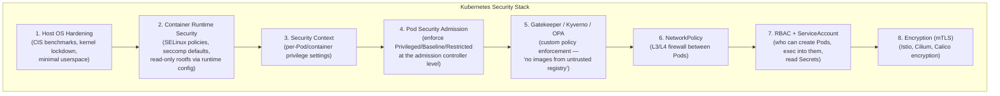

In the Linux kernel, every process runs with a set of attributes: a user ID, a group ID, a set of capabilities, a seccomp profile, an SELinux or AppArmor label. By default, a container inherits the kernel's default values for all of these — which means, by default, it runs as **root**.

This is the single largest security gap in Kubernetes. The container runtime (CRI-O, containerd) does create namespaces (PID, network, mount, UTS, user) that isolate the container from the host, but the process *inside* the namespace still runs as UID 0, still has default Linux capabilities, and still has access to hundreds of system calls. A container breakout exploit (CVE-2022-0492, CVE-2024-21626) can leverage this overly permissive baseline to escape the container and gain root access on the host.

Security contexts are the mechanism for closing this gap — field by field, privilege by privilege.

---

## The Linux Kernel Primitives That Security Contexts Control

Before we can understand security contexts, we need to understand what they control in the kernel.

### User and group IDs (UID/GID)

Every Linux process has a real UID, effective UID, and saved UID. These determine what files the process can read, write, and execute. The root user (UID 0) bypasses all permission checks — it can read `/etc/shadow`, write to `/proc/sys`, ptrace any process, and escape most namespaces.

### Linux capabilities

Linux divides the privileges traditionally associated with root into ~40 distinct **capabilities**. Instead of granting a process full root access, you can grant specific capabilities:

| Capability | What it allows | Risk if granted |
|-----------|----------------|----------------|
| `CAP_NET_ADMIN` | Configure network interfaces, iptables | Enables MITM between Pods |
| `CAP_SYS_ADMIN` | Mount filesystems, access namespaces | Essentially full root — never grant |
| `CAP_SYS_PTRACE` | ptrace any process in the namespace | Bypass memory isolation |
| `CAP_NET_BIND_SERVICE` | Bind to ports < 1024 | Low risk — allows serving on port 80 |
| `CAP_DAC_OVERRIDE` | Bypass file read/write permission checks | Read any file in the container |
| `CAP_SYS_RAWIO` | Read/write raw block devices | Port scan host's block storage |
| `CAP_SETUID` / `CAP_SETGID` | Change UID/GID arbitrarily | Escalate to root within the container |

A Docker/CRI-O container starts with a default set of ~14 capabilities. The security context lets you drop this set to zero and re-add only what is necessary.

### Seccomp

Seccomp (secure computing mode) is a Linux kernel feature that filters system calls. A process can install a BPF (Berkeley Packet Filter) program that the kernel evaluates before every syscall. If the filter says "deny," the syscall is blocked, and the process receives `SYS_KILL` (killed) or `SYS_ERRNO` (gets an `EPERM` error).

The Linux kernel has ~450 system calls. A typical web application needs around 50–80. Seccomp closes the rest.

### SELinux / AppArmor

**SELinux** (Security-Enhanced Linux, developed by NSA, integrated into the kernel since 2003) implements **Mandatory Access Control (MAC)**. Every process is assigned a security context like:

```
system_u:system_r:container_t:s0:c123,c456
```

- **User**: `system_u` (SELinux user, not Linux UID)
- **Role**: `system_r` (the process type)
- **Type**: `container_t` — the domain that defines what files and sockets this process can access
- **Level**: `s0:c123,c456` — Multi-Category Security (MCS) separation

Even if a process is root inside the container, SELinux can prevent it from writing to `/etc/shadow` on the host because the types differ (`container_t` vs `initrc_t`).

**AppArmor** is an alternative MAC system (default on Debian/Ubuntu) that uses path-based profiles instead of type labels. Both achieve the same goal: the kernel enforces a policy that the root user inside the container cannot bypass.

### Read-only root filesystem

The container's writable layer (the overlayfs or aufs mount) is a primary attack vector. An exploit that gains code execution can write a script to `/tmp/exploit.sh`, modify `/usr/bin/python`, or install a cryptominer in `/var/lib/`. Mounting the root filesystem as read-only closes this vector—the process cannot write anywhere on the rootfs except explicitly mounted volumes.

---

## Pod-Level vs Container-Level Security Context

The security context can be set at two levels, and their interaction is important:

```yaml
apiVersion: v1
kind: Pod
metadata:
  name: double-layered-security
spec:
  securityContext:               # pod-level — applies to ALL containers
    runAsUser: 1000
    runAsGroup: 3000
    fsGroup: 2000
    seLinuxOptions:
      level: "s0:c123,c456"
  containers:
    - name: sidecar
      image: sidecar:1.0
      # inherits UID 1000, GID 3000 from pod-level
    - name: main
      image: main:1.0
      securityContext:           # container-level — overrides pod-level
        runAsUser: 1001          # this specific container runs as UID 1001
        capabilities:
          drop: ["ALL"]
        readOnlyRootFilesystem: true
```

| Rule | Semantics |
|------|-----------|
| Container-level fields override pod-level fields | `runAsUser` at container level replaces pod-level for that container |
| Pod-level fields are the default for containers that don't set their own | A container without a container-level security context inherits the pod-level one |
| Some fields are pod-only | `fsGroup`, `supplementalGroups`, `seLinuxOptions` (at pod level), `sysctls` |
| Some fields are container-only | `capabilities`, `privileged`, `readOnlyRootFilesystem`, `allowPrivilegeEscalation` |

---

## Every SecurityContext Field, Explained

### `runAsUser: <int>` — The UID the container's entrypoint runs as

```yaml
securityContext:
  runAsUser: 1001
```

The most impactful security field. When set, the container's entrypoint process runs as that UID. If the UID does not exist in `/etc/passwd` inside the container, that's fine — the kernel doesn't care. What matters is file access: if a volume mounted into the container is owned by UID 1001 with permissions 0700, the process can read and write it regardless of `/etc/passwd`.

**The default is root (UID 0).** This means any process inside the container — including one spawned by an attacker via a code execution exploit — can read `/etc/shadow`, write to `/usr/bin/`, install packages, modify the container's resolv.conf, and do everything root can do inside that namespace.

**Why this exists:** Most Dockerfiles use a `USER` directive, but many don't. Even those that do may have their `USER` overridden by a downstream image. `runAsUser: 1001` at the Pod level is a safety net: regardless of what the image does, the Pod enforces a non-root UID.

### `runAsGroup: <int>` — The primary GID

```yaml
securityContext:
  runAsUser: 1001
  runAsGroup: 1001
```

Without this, the group defaults to whatever `/etc/passwd` says for the UID (usually the same as the UID if it exists, or root's group GID 0 if not). Setting both explicitly guarantees the correct group ownership on created files.

### `fsGroup: <int>` — Volume ownership

```yaml
spec:
  securityContext:
    fsGroup: 2000
```

When set, kubelet **recursively `chown`s** all volumes mounted into the Pod to this GID. This is essential for stateful workloads.

**The problem it solves:** A container running as UID 1001 needs to write to a PersistentVolume. The PV was created by the CSI driver and is owned by root:root with permissions 0755 (or even 0700). UID 1001 cannot write to it. `fsGroup: 2000` tells kubelet to change the volume's group ownership to 2000 and the process (running as UID 1001, GID 3000) can write because it's a member of GID 2000 via `supplementalGroups`.

### `supplementalGroups: [<int>]` — Additional GIDs

```yaml
spec:
  securityContext:
    supplementalGroups: [2000, 3000, 4000]
```

The process runs with these group IDs in addition to its primary GID. Useful when a volume allows access via multiple groups.

### `runAsNonRoot: <bool>` — Reject root images

```yaml
securityContext:
  runAsNonRoot: true
```

kubelet checks the container image's entrypoint UID (from the Dockerfile's `USER` directive or the image config). If the entrypoint would run as UID 0, the Pod is rejected with `VerifyNonRoot: container is running as root`. This is an **image-independent** guarantee.

**Production rule:** Every Pod should set either `runAsNonRoot: true` or `runAsUser` to a non-zero value. Together, these two fields are the single most impactful security context configuration.

### `capabilities: { drop: [...], add: [...] }` — Fine-grained kernel privilege control

```yaml
securityContext:
  capabilities:
    drop: ["ALL"]
    add: ["NET_BIND_SERVICE"]
```

This is the principle of least privilege applied to the kernel. Instead of asking "what can root do?" we ask "what does this container need?" The standard production pattern:

1. `drop: ["ALL"]` — remove every capability.
2. `add: ["NET_BIND_SERVICE"]` — add back only what is required.

A typical web application needs only `NET_BIND_SERVICE` (binding to port 80/443). A metrics scraper might also need `NET_RAW` (ICMP ping). A network plugin needs `NET_ADMIN`. Anything beyond `NET_BIND_SERVICE + NET_RAW + SYS_TIME` warrants scrutiny.

### `privileged: <bool>` — All-or-nothing root

```yaml
securityContext:
  privileged: true
```

The container gets every capability and can access every kernel device. It can mount the host filesystem, load kernel modules, and escape namespaces. **Do not use in production.** The only legitimate use cases are:

- CNI plugins that need to configure the host's network interfaces
- Storage drivers that need to mount devices
- Debugging containers (temporary, with manual approval)

Kubernetes audit tools (`kube-bench`, `kubescape`, `kyverno`) flag privileged containers by default. Many organizations block them entirely with admission controllers.

### `allowPrivilegeEscalation: <bool>` — Prevent setuid

```yaml
securityContext:
  allowPrivilegeEscalation: false
```

When true (the default in many runtimes), a process inside the container can gain **more privileges than its parent** — via `setuid` binaries, `sudo`, or `setcap`. Setting this to `false` ensures that even if an attacker uploads a `setuid` binary, it cannot run with elevated privileges.

**The deep reason:** A container running as UID 1001 with `allowPrivilegeEscalation: true` could execute `/usr/bin/su` (if available and owned by root) to become any user — potentially root. With escalation disabled, `setuid` is ignored; the binary runs as UID 1001 regardless of its file permissions.

### `readOnlyRootFilesystem: <bool>` — Make the rootfs immutable

```yaml
securityContext:
  readOnlyRootFilesystem: true
```

The container's writable layer is mounted as read-only. The process cannot write to `/tmp`, `/var/tmp`, or any other path on the root filesystem. It must write to explicitly mounted volumes (an `emptyDir` for ephemeral data, a `PersistentVolumeClaim` for persistent data).

**This is the second-most-impactful field after `runAsUser`.** A read-only rootfs means an attacker who gains code execution cannot drop a payload script, cannot modify the application binary, cannot write a cron job, and cannot install packages. Combined with a non-root UID, it eliminates entire classes of post-exploitation attacks.

The biggest challenge: your application must be written to handle a read-only rootfs. Java applications that write to `/tmp` need `-Djava.io.tmpdir=/var/tmp` (with an `emptyDir` mounted at `/var/tmp`). Python applications need `PYTHONPYCACHEPREFIX` set.

### `seccompProfile: { type: ... }` — Syscall filtering

```yaml
securityContext:
  seccompProfile:
    type: RuntimeDefault
```

Three types are supported:

| Type | Behavior |
|------|----------|
| `RuntimeDefault` | Uses the container runtime's seccomp profile (typically allows ~300 of ~450 syscalls). Since Kubernetes v1.27, this is effectively the default for new Pods. |
| `Localhost` | A custom JSON seccomp profile on the node's filesystem. `localhostProfile: "profiles/audit.json"` loads from `/var/lib/kubelet/seccomp/profiles/audit.json`. |
| `Unconfined` | No seccomp — all syscalls allowed. **Not recommended for production.** |

A custom seccomp profile is created by running the container under audit mode first:

```json
{
  "defaultAction": "SCMP_ACT_ERRNO",
  "architectures": ["SCMP_ARCH_X86_64"],
  "syscalls": [
    {
      "names": ["accept4", "accept", "bind", "brk", "clock_gettime",
                 "close", "connect", "epoll_create1", "epoll_ctl",
                 "epoll_pwait", "exit", "exit_group", "fchmod",
                 "fcntl", "fstat", "ftruncate", "futex", "getdents64",
                 "getpeername", "getpid", "getsockname", "getsockopt",
                 "listen", "lseek", "mmap", "mprotect", "munmap",
                 "nanosleep", "openat", "poll", "ppoll", "pread64",
                 "pwrite64", "read", "readlinkat", "recvfrom",
                 "recvmsg", "rseq", "rt_sigaction", "rt_sigprocmask",
                 "rt_sigreturn", "sendmmsg", "sendmsg", "sendto",
                 "set_robust_list", "set_tid_address", "setsockopt",
                 "shutdown", "socket", "statx", "sysinfo", "tgkill",
                 "umask", "uname", "write", "writev"],
      "action": "SCMP_ACT_ALLOW"
    }
  ]
}
```

### `seLinuxOptions` — SELinux context

```yaml
securityContext:
  seLinuxOptions:
    user: system_u
    role: system_r
    type: container_t
    level: "s0:c1,c2"
```

On systems with SELinux enabled (RHEL, CentOS, Fedora CoreOS, OpenShift), this sets the SELinux context of the container's processes. CRI-O automatically assigns a unique MCS category set to each Pod (`s0:c<random>,c<random>`) for isolation, but you can override it.

The type (`container_t`, `spc_t`, `svirt_lxc_net_t`) determines what files and processes the container can access. `container_t` is the standard type for regular containers.

### `procMount: string` — Masking /proc

```yaml
securityContext:
  procMount: Default
```

Two options: `Default` (the standard `/proc` with some files masked) or `Unmasked` (all of `/proc` visible, including kernel parameters and other process information).

### `sysctls: [{name, value}]` — Kernel parameters

```yaml
spec:
  securityContext:
    sysctls:
      - name: net.ipv4.tcp_syncookies
        value: "0"
      - name: net.core.somaxconn
        value: "1024"
```

Kubernetes categorizes sysctls as **safe** (namespaced, already isolated) and **unsafe** (not namespaced, affect the host). Only safe sysctls are allowed by default. Unsafe sysctls require a cluster-level flag (`--allowed-unsafe-sysctls`) on kubelet.

---

## The Broader Kubernetes Security Stack

Security contexts are the innermost layer of a multi-layer defense. They control what a process can do *inside the container*. Above them sit several other layers that control what happens *to the container*.



| Layer | Mechanism | What it protects against |
|-------|-----------|------------------------|
| 1 — Host OS | Kernel lockdown, minimal packages | Kernel exploits from inside a container |
| 2 — Runtime | SELinux/AppArmor, default seccomp | Container breakout via runtime bugs |
| 3 — Security Context | `runAsUser`, capabilities, `readOnlyRootFS` | Post-exploitation within the container |
| 4 — Pod Security Admission | PSS levels (Baseline, Restricted) | Misconfigured Pod specs with root or privileged access |
| 5 — Admission Controllers | OPA, Kyverno, custom webhooks | Pods violating organizational policy |
| 6 — NetworkPolicy | iptables/BPF rules | Lateral movement between compromised Pods |
| 7 — RBAC | Role, ClusterRole, RoleBinding | Unauthorized API access, privilege escalation |
| 8 — mTLS | WireGuard, Istio, Cilium encryption | Traffic interception between Pods |

### Pod Security Standards (PSS)

Kubernetes defines three standard levels enforced by the `PodSecurity` admission controller (which replaced PodSecurityPolicy in v1.25):

| Level | What it requires | Example workloads |
|-------|-----------------|-------------------|
| **Privileged** | Nothing — all settings allowed | CNI plugins, storage drivers, monitoring agents that need host access |
| **Baseline** | `privileged: false`, `allowPrivilegeEscalation: false`, `capabilities.drop: ["ALL"]` (with narrow add-backs), `seccomp: RuntimeDefault`, no `hostPID`/`hostNetwork`/`hostIPC` | Most stateless and stateful microservices |
| **Restricted** | All of Baseline + `runAsNonRoot: true` (or `runAsUser > 10000`), `seccomp: RuntimeDefault`, `capabilities.drop: ["ALL"]`, `readOnlyRootFilesystem: true` (strongly recommended) | PCI/HIPAA/SOC2-regulated workloads |

You can enforce these at the namespace level:

```yaml
apiVersion: v1
kind: Namespace
metadata:
  labels:
    pod-security.kubernetes.io/enforce: restricted
    pod-security.kubernetes.io/enforce-version: latest
  name: production
```

Any Pod in this namespace that violates the Restricted level is rejected. The admission controller evaluates the effective security context (after defaults and mutations) and compares it against the PSS requirements.

### Admission Controllers as a safety net

Security contexts are fine-grained but they are also **per-Pod**. If your developers can create Pods directly (via `kubectl run` or a CI/CD pipeline), one Pod with `privileged: true` bypasses your entire hardening strategy.

This is why admission controllers exist:

- **Kyverno** — Kubernetes-native policy engine. Example: deny any Pod that doesn't set `runAsNonRoot: true`.
- **OPA/Gatekeeper** — general-purpose policy engine using Rego. Example: enforce that all images in production are signed.
- **Kubewarden** — WebAssembly-based policies.
- **Cloud-native policies** — built into managed K8s (AKS, GKE, EKS have their own policy managers).

```yaml
# Kyverno policy: enforce non-root user
apiVersion: kyverno.io/v1
kind: ClusterPolicy
metadata:
  name: require-run-as-non-root
spec:
  validationFailureAction: Enforce
  rules:
    - name: check-run-as-non-root
      match:
        resources:
          kinds:
            - Pod
      validate:
        message: "Running as root is not allowed. Set runAsNonRoot: true or runAsUser > 0."
        anyPattern:
          - spec:
              securityContext:
                runAsNonRoot: true
          - spec:
              securityContext:
                runAsUser: ">0"
```

---

## Real-World Configurations

### Minimum viable production configuration

```yaml
apiVersion: v1
kind: Pod
metadata:
  name: stateless-api
spec:
  securityContext:
    runAsNonRoot: true
    runAsUser: 10001
    runAsGroup: 10001
    fsGroup: 10001
    seccompProfile:
      type: RuntimeDefault
  containers:
    - name: api
      image: my-api:1.0
      securityContext:
        allowPrivilegeEscalation: false
        capabilities:
          drop: ["ALL"]
          add: ["NET_BIND_SERVICE"]
        readOnlyRootFilesystem: true
        runAsUser: 10001
      volumeMounts:
        - name: tmp
          mountPath: /tmp
      ports:
        - containerPort: 8080
  volumes:
    - name: tmp
      emptyDir: {}
```

This configuration:

- Runs as non-root (UID 10001)
- Drops all Linux capabilities except `NET_BIND_SERVICE`
- Prevents privilege escalation
- Makes the rootfs read-only (any temp writes go to the `emptyDir`)
- Uses the runtime's seccomp profile
- Sets `fsGroup` to ensure volume ownership matches
- Uses the `PodSecurity` Baseline level (and most of Restricted)

### How to test your configuration

```bash
# Check what user a container runs as
kubectl exec my-pod -- whoami

# Check capabilities
kubectl exec my-pod -- cat /proc/self/status | grep Cap

# Check seccomp
kubectl exec my-pod -- cat /proc/self/status | grep Seccomp
# 0 = disabled, 1 = strict, 2 = filter

# Check if rootfs is read-only
kubectl exec my-pod -- touch /test-file
```

---

## The History

Security contexts have existed since Kubernetes v1.0, but their evolution tracks the growing maturity of container security:

- **v1.0 (2015):** Basic `securityContext` with `runAsUser`, `runAsGroup`, `capabilities`, `privileged`. No `seccomp`, no `readOnlyRootFilesystem`, no `runAsNonRoot`.
- **v1.3 (2016):** `securityContext` expanded to Pod-level (`pod.Spec.SecurityContext`) with `fsGroup` and `supplementalGroups`.
- **v1.8 (2017):** `runAsNonRoot` added — the first image-independent security check.
- **v1.10 (2018):** `readOnlyRootFilesystem` and `allowPrivilegeEscalation` added.
- **v1.19 (2020):** `seccompProfile` graduated to stable after years as alpha. `procMount` added.
- **v1.25 (2022):** `PodSecurityPolicy` removed in favor of `PodSecurity` admission + Pod Security Standards. `seccompProfile` defaults to `RuntimeDefault` for new clusters.
- **v1.27 (2023):** `seccompProfile.type: RuntimeDefault` becomes the default kubelet behavior if the field is omitted.

---

## The Mental Model

> A default container runs as root with a broad set of kernel capabilities and unfiltered system calls — the most permissive environment the kernel can create inside a namespace. Security contexts strip this back layer by layer: drop all capabilities, run as a non-root user, make the filesystem read-only, restrict system calls, and prevent privilege escalation. Each field individually reduces the blast radius of a compromise; together they make a container look, to the kernel, like an ordinary user process with no special permissions — exactly where every production workload should be.

---

## References

- [Configure a Security Context](https://kubernetes.io/docs/tasks/configure-pod-container/security-context/)
- [Pod Security Standards](https://kubernetes.io/docs/concepts/security/pod-security-standards/)
- [Pod Security Admission](https://kubernetes.io/docs/concepts/security/pod-security-admission/)
- [Linux Capabilities (man 7 capabilities)](https://man7.org/linux/man-pages/man7/capabilities.7.html)
- [Seccomp BPF (kernel documentation)](https://www.kernel.org/doc/html/latest/userspace-api/seccomp_filter.html)
- [SELinux Documentation](https://selinuxproject.org/page/Main_Page)
- [CIS Benchmark for Kubernetes](https://www.cisecurity.org/benchmark/kubernetes)
- [Kyverno Policies](https://kyverno.io/policies/)
- [OPA Gatekeeper](https://open-policy-agent.github.io/gatekeeper/website/)
- [CVE-2022-0492 — cgroup escape](https://unit42.paloaltonetworks.com/cve-2022-0492-cgroups/)
- [CVE-2024-21626 — runc container escape](https://nvd.nist.gov/vuln/detail/CVE-2024-21626)
