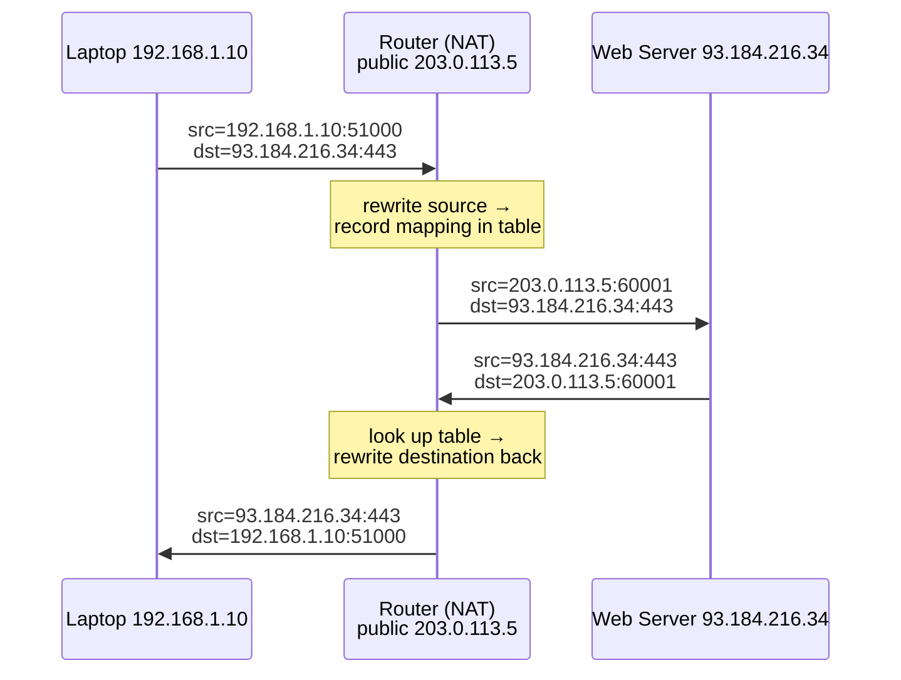
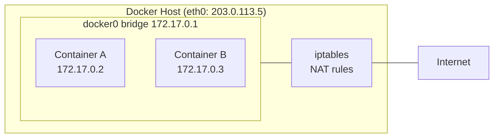
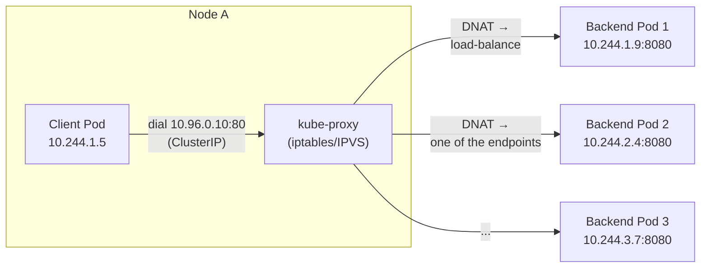
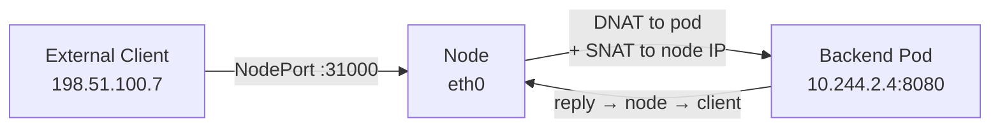

Network Address Translation is one of those concepts you can use for years without ever really *seeing* it. It hides behind your home router, behind `docker run`, behind every `ClusterIP` service in Kubernetes. And it's all the same core trick: **a device in the middle rewrites the addresses on packets as they pass through, and remembers enough to rewrite the replies back.**

This post builds NAT from the ground up — the plain networking idea first, then exactly how Docker uses it to give containers connectivity, and finally how Kubernetes layers its whole service model on top of the same primitive.

## Why NAT exists at all

The original sin is arithmetic. IPv4 has ~4.3 billion addresses. There are far more than 4.3 billion devices that want to be on the internet. That math never worked, so we carved out **private address ranges** — blocks of IPs that anyone can reuse internally because they're never routed on the public internet:

| Range | Size | Where you see it |
|---|---|---|
| `10.0.0.0/8` | ~16.7M | Corporate networks, Kubernetes pod CIDRs |
| `172.16.0.0/12` | ~1M | Docker's default bridge (`172.17.0.0/16`) |
| `192.168.0.0/16` | ~65K | Home/office routers |

Your laptop, your phone, and your smart fridge all sit on `192.168.1.x` behind your router. They can't be reached directly from the internet — the address is meaningless out there. So how does your laptop load a webpage? **NAT.** Your router owns *one* real public IP, and it multiplexes every internal device onto it by rewriting packets.

## The core mechanism: rewriting addresses in flight

Here's the move. When your laptop (`192.168.1.10`) sends a packet to a web server, the packet's source is a private address the internet can't reply to. So the router intercepts it, **swaps the source address** to its own public IP, and writes down what it did in a translation table. When the reply comes back, it looks up the table and **swaps the destination back** to your laptop.



The magic is in that table. But if the router only rewrote IP addresses, two laptops both talking to the same server would collide — the replies would be indistinguishable. So real-world NAT rewrites the **port too**. That's **PAT (Port Address Translation)**, sometimes called *NAT overload* or *masquerading*, and it's what everyone actually means when they say "NAT" today.

The translation table looks roughly like this:

```text
Internal (private)          External (public)           Remote
192.168.1.10:51000    →    203.0.113.5:60001    →    93.184.216.34:443
192.168.1.11:49200    →    203.0.113.5:60002    →    93.184.216.34:443
192.168.1.10:51001    →    203.0.113.5:60003    →    140.82.113.4:443
```

Each `(internal ip, internal port)` gets a unique `(public ip, public port)`. The remote server sees only the router's public IP; the router uses the port to demultiplex replies back to the right device. One public address, thousands of concurrent connections.

### SNAT vs DNAT — the two directions

Two terms you'll hit constantly, especially in Docker and Kubernetes:

- **SNAT (Source NAT)** — rewrite the *source* address of outgoing packets. This is the home-router case above: private clients reaching out. Masquerading is dynamic SNAT (source IP picked from whatever the outgoing interface has).
- **DNAT (Destination NAT)** — rewrite the *destination* address of incoming packets. This is **port forwarding**: "traffic hitting my public IP on port 8080 → send it to `192.168.1.50:80` inside." This is how you expose an internal service to the outside.

Hold onto these two. **Docker and Kubernetes are almost entirely built out of SNAT + DNAT rules.**

## NAT in Docker

When you `docker run` a container, it gets its own network namespace with its own private IP — by default on the `172.17.0.0/16` bridge network. That IP is as unroutable to the outside world as your laptop's `192.168.x.x`. Docker makes containers work using exactly the same NAT trick your router uses, implemented with **iptables** rules on the host.



**Outbound (container → internet): SNAT / masquerade.** Container A (`172.17.0.2`) wants to `apt update`. Its packet leaves with a source of `172.17.0.2`, which the internet can't reply to. Docker installs a masquerade rule so the host rewrites the source to the host's own IP on the way out — identical to your router. You can see the actual rule:

```bash
$ iptables -t nat -L POSTROUTING -n
Chain POSTROUTING (policy ACCEPT)
target     prot opt source          destination
MASQUERADE  all  --  172.17.0.0/16   0.0.0.0/0
```

That single line says: *any packet sourced from the container subnet heading anywhere → masquerade it.* That's container internet access, top to bottom.

**Inbound (internet → container): DNAT / port publishing.** When you run:

```bash
docker run -d -p 8080:80 nginx
```

…you're asking for a DNAT rule. "`-p 8080:80`" means *traffic arriving on the host's port 8080 → rewrite the destination to the container's `172.17.0.2:80`.* Docker writes it into the `DOCKER` chain:

```bash
$ iptables -t nat -L DOCKER -n
Chain DOCKER (2 references)
target  prot opt source     destination
DNAT    tcp  --  0.0.0.0/0  0.0.0.0/0  tcp dpt:8080 to:172.17.0.2:80
```

So the whole `docker run -p` model — the thing you use every day — is just a DNAT rule plus the masquerade rule for the replies. When you understand NAT, `-p host:container` stops being magic and becomes obvious: left side is the host port people connect to, right side is the DNAT target inside.

> **Why containers on the same bridge reach each other without NAT:** they're on the same `172.17.0.0/16` subnet, bridged at L2 by `docker0`. No translation needed — it's a plain local network. NAT only kicks in crossing the boundary between the private container net and the outside.

## NAT in Kubernetes

Kubernetes takes the same ideas and scales them across a cluster of nodes. This is where it gets genuinely clever, because Kubernetes makes a strong promise called the **flat pod network**:

> Every pod gets its own cluster-wide-unique IP, and **every pod can reach every other pod directly, on any node, without NAT.**

That's a deliberate design choice — it makes pods behave like VMs on a flat network and keeps application code blissfully unaware of topology. The CNI plugin (Calico, Cilium, flannel, etc.) makes pod-to-pod routing work without translation. So if pods talk to each other NAT-free… where does NAT come back in?

**Two places: Services, and egress to the outside world.**

### Services and the ClusterIP illusion

Pods are ephemeral — they die, restart, and get new IPs constantly. You can't hardcode a pod IP. So Kubernetes gives you a **Service**: a stable **virtual IP** (the ClusterIP) that fronts a shifting set of pods. That ClusterIP isn't assigned to any network interface anywhere — it's a fiction maintained entirely by NAT rules on every node, programmed by **kube-proxy**.



When your client pod connects to a Service's ClusterIP (say `10.96.0.10:80`), here's what happens:

1. The packet heads for `10.96.0.10` — an IP that exists nowhere physically.
2. kube-proxy's rules on the node intercept it and perform **DNAT**, rewriting the destination to one of the actual backend pod IPs (e.g. `10.244.2.4:8080`), picking an endpoint to load-balance across the healthy pods.
3. The reply is un-DNAT'd on the way back, so the client believes it talked to `10.96.0.10` the whole time.

The ClusterIP is, quite literally, **a destination that only exists as a NAT rule.** kube-proxy watches the API server for Service and Endpoint changes and rewrites these rules continuously as pods come and go.

Here's the kind of rule chain kube-proxy installs (iptables mode) — a DNAT to a chosen endpoint:

```bash
# Service ClusterIP jump
-A KUBE-SERVICES -d 10.96.0.10/32 -p tcp --dport 80 -j KUBE-SVC-XXXX
# Load-balance: ~33% to each endpoint chain
-A KUBE-SVC-XXXX -m statistic --mode random --probability 0.333 -j KUBE-SEP-AAA
-A KUBE-SVC-XXXX -m statistic --mode random --probability 0.500 -j KUBE-SEP-BBB
-A KUBE-SVC-XXXX -j KUBE-SEP-CCC
# The actual DNAT to a pod
-A KUBE-SEP-AAA -p tcp -j DNAT --to-destination 10.244.2.4:8080
```

That's the entire Service abstraction, demystified: statistical load-balancing plus DNAT.

### NodePort, external traffic, and the SNAT gotcha

For `type: NodePort` / `LoadBalancer`, external traffic hits a node on a high port and gets **DNAT'd** to a backend pod — possibly a pod on a *different* node. Here's the subtle part that trips people up: to make the return path work, kube-proxy usually also **SNATs** that traffic (masquerades it to the node's IP). Otherwise the backend pod would reply directly to the external client, whose connection was expecting a reply from the node — and the packet would be dropped as unrecognized.

The tradeoff: that SNAT **hides the client's real source IP** from your application (it sees the node IP instead). The fix is `externalTrafficPolicy: Local`, which only routes to pods on the receiving node and skips the SNAT — preserving the real client IP at the cost of even load distribution.



### Egress: pods reaching the internet

And finally, the loop closes right back to where we started. When a pod dials out to the public internet, its `10.244.x.x` source is — you guessed it — unroutable outside the cluster. So the node **masquerades (SNAT)** the pod's traffic to the node's own IP on the way out, exactly like Docker's `docker0` masquerade, exactly like your home router. Same trick, three different scales.

## The one mental model to keep

Strip away the layers and it's a single idea appearing three times:

> A device in the path **rewrites source and/or destination addresses**, keeps a **table** so it can reverse the rewrite on replies, and thereby lets **private, unroutable addresses talk to the outside world** — and lets the outside reach specific private services.

- **Home router:** SNAT out (share one public IP), DNAT in (port forwarding).
- **Docker:** masquerade out (`docker0` → internet), DNAT in (`-p 8080:80`).
- **Kubernetes:** DNAT for Services (ClusterIP → pod), SNAT for egress and NodePort return paths; pod-to-pod stays NAT-free by design.

Once you see the pattern, `iptables -t nat -L` stops being intimidating and starts reading like a story: *who's being rewritten, in which direction, and how the reply finds its way home.* That story is the same whether it's your living room or a 500-node cluster.
