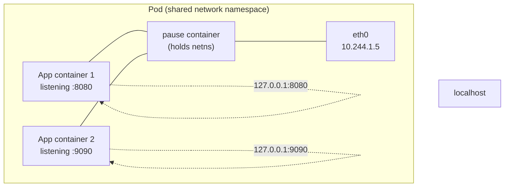
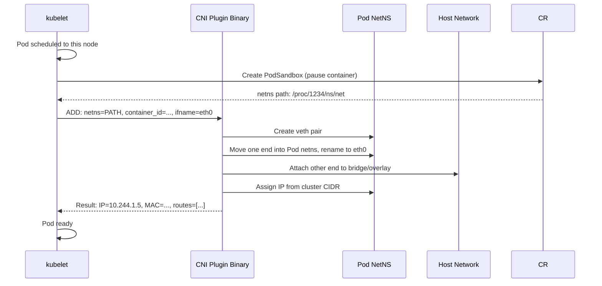
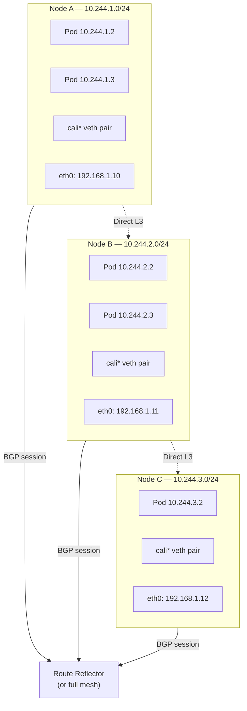
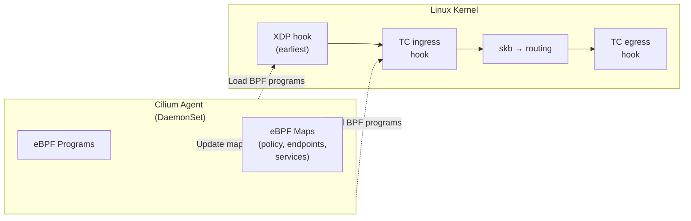
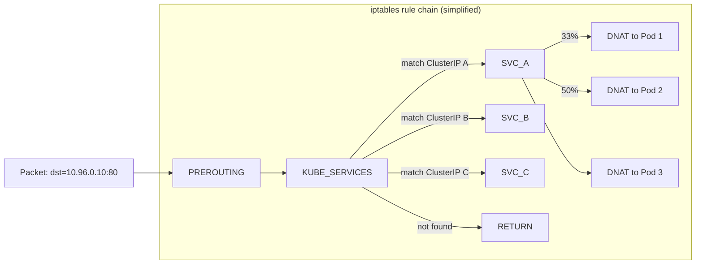
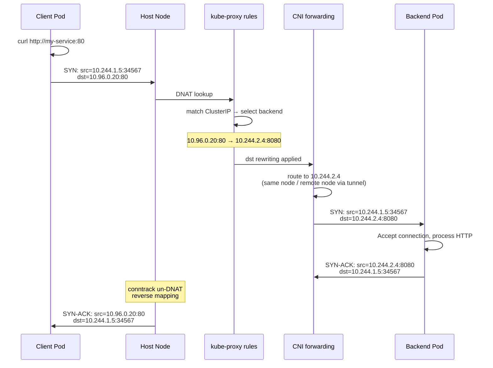

Kubernetes networking is the most complex, most misunderstood, and most critical subsystem in the entire platform. Every pod, every service, every ingress, every inter-node packet flows through a stack of components that were designed by some of the sharpest minds in distributed systems.

This post breaks that stack down layer by layer — from the abstract design principles to the concrete iptables rules on your nodes.

---

## The Birth of the Kubernetes Networking Model

Before Kubernetes v1.0 was released in July 2015, the Google engineers behind the project (Borg veterans) had one overriding insight about networking: **application developers should not have to think about topology**. In Borg, every task got its own IP and the network was flat. The Kubernetes networking model codified this same philosophy.

The original design document, circulated in 2014, established four axioms:

1. Every Pod gets its own unique, cluster-wide IP address.
2. Every Pod can reach every other Pod directly, across any node, without NAT.
3. Every node can reach every Pod on itself and on every other node.
4. Communication from a Pod to itself via `localhost` reaches its own containers — the Pod shares a network namespace.

These four rules sound simple, but their implications are profound. They mean Kubernetes treats every Pod like a VM or a physical host on a flat LAN. Applications that were written for a traditional network — bind to a port, listen, accept connections — work inside a Pod without modification.

### The pause container trick

Axiom 4 is enabled by an elegant hack: the **pause container** (`registry.k8s.io/pause:3.9`, about 700KB). Before any application container starts, kubelet instructs the container runtime to create a "sandbox" (called a `PodSandbox` in CRI parlance) using the pause image. This container does nothing but `pause(2)` forever, holding the network namespace open. All other containers in the Pod join that namespace via `--network=container:<pause>`.

The result: every container in a Pod shares the same IP, the same port space, and the same localhost. `localhost:8080` in container A reaches a service listening on `:8080` in container B. No DNS, no discovery, no environment variables — just the kernel's loopback interface.



## The CNI Specification

The third axiom — every node can reach every Pod — is the hard part. Kubernetes deliberately does not implement it inside the core binary. Instead, it delegates to the **Container Network Interface (CNI)**, a specification originally developed by CoreOS as part of the rkt project and adopted by Kubernetes in 2015.

### How the CNI contract works

CNI defines a binary-plugin contract. When kubelet needs to set up a Pod's network:

1. kubelet reads the CNI configuration from `/etc/cni/net.d/*.conflist` (typically installed by the cluster provisioner).
2. It calls the CNI plugin binary (e.g., `/opt/cni/bin/calico`) with the Pod's network namespace path, the container ID, and the configuration JSON piped via stdin.
3. The plugin adds a veth pair, attaches one end to the Pod's namespace, attaches the other to a bridge or an overlay interface on the host, and assigns an IP address.
4. The plugin returns the result (IP, MAC, routes) as JSON on stdout.

The contract is deliberately thin. The plugin gets called twice in a Pod's lifecycle: `ADD` when the Pod starts, `DEL` when it's deleted. That's it.



## The Four Major CNI Plugin Families

Every CNI plugin implements the same contract, but they do it completely differently under the hood.

### Flannel (2014, CoreOS)

The simplest and oldest. Flannel was created alongside CoreOS's rkt initiative and was the default CNI for many early Kubernetes deployments.

**Architecture:** Flanneld runs as a DaemonSet on every node. Each node is allocated a `/24` subnet from the cluster CIDR (e.g., `10.244.0.0/16` → node A gets `10.244.1.0/24`, node B gets `10.244.2.0/24`). Pods on the same node communicate via a Linux bridge (`cni0`). Pods on different nodes communicate through an **overlay tunnel** — by default VXLAN (UDP port 8472).

```text
Pod A (10.244.1.2) on Node A → ping Pod B (10.244.2.3) on Node B

1. Pod A sends ICMP to 10.244.2.3 via its default route (the bridge)
2. Node A's routing table says: 10.244.2.0/24 via flannel.1 (VXLAN device)
3. flannel.1 encapsulates the packet: original L2 frame wrapped in UDP.
   Outer headers: src=Node_A_IP:8472, dst=Node_B_IP:8472
4. Node B receives the VXLAN packet, flannel.1 decapsulates it
5. The inner frame is delivered to Pod B's veth
```

**Performance overhead:** VXLAN adds ~50 bytes of encapsulation headers per packet (20 IP + 8 UDP + 8 VXLAN). Throughput is typically 90–95% of line rate. CPU overhead is moderate (encapsulation in the kernel).

**Best for:** Small to medium clusters, homelabs, environments where simplicity matters more than raw performance.

### Calico (2015, Tigera)

Calico takes the opposite approach: **no overlay, pure L3 routing**. It treats the cluster as a giant IP fabric where every node is a router.

**Architecture:** Calico uses **BGP (Border Gateway Protocol)** — the same protocol that powers the Internet's backbone — to distribute pod subnet routes between nodes. Each node runs a BGP client (Felix + Bird or the newer Calico node) that peers with other nodes (full mesh) or with route reflectors.



When a pod on Node A sends to a pod on Node B, the packet goes straight through the host's routing table — the kernel looks up `10.244.2.0/24 → via 192.168.1.11 dev eth0` and forwards the raw IP packet. No encapsulation, no extra headers. This gives Calico the best throughput of any CNI plugin in most configurations.

**Performance:** Near line rate. Latency overhead is sub-microsecond (just a kernel routing table lookup). The flip side is that Calico requires the underlay network to route the pod CIDRs — which means you either need BGP support in your physical network, or you accept the complexity of running BGP route reflectors.

**eBPF mode:** Since 2021, Calico supports an **eBPF data plane** that replaces iptables with BPF programs attached to the host's TC hooks. This eliminates iptables rule traversal overhead and enables features like direct server return (DSR) for load balancing.

**NetworkPolicy:** Calico's original reason for existing was network policy. It supports fine-grained Kubernetes NetworkPolicy plus Calico-specific GlobalNetworkPolicy with tiered deny-allow-deny rules.

### Cilium (2017, Isovalent)

Cilium is the newest major CNI and represents the next generation. It was built entirely around **eBPF (extended Berkeley Packet Filter)** — a Linux kernel technology that allows running sandboxed programs in kernel space without modifying kernel code.

**Architecture:** Cilium does not use iptables at all. Instead, it compiles network policies and routing decisions into eBPF bytecode and attaches that bytecode to kernel hooks:

| Hook | Purpose |
|------|---------|
| **TC (Traffic Control) ingress/egress** | Pod-to-pod and pod-to-service packet handling |
| **XDP (eXpress Data Path)** | Early packet processing before the kernel stack — used for DDoS protection and load balancing |
| **cgroup socket** | Per-socket policy enforcement |
| **tracepoint/kprobe** | Observability (Hubble) |



**Performance:** Because eBPF programs run in-kernel and skip the iptables netfilter stack entirely, Cilium achieves 2–3× the throughput of iptables-based plugins for service load-balancing and policy enforcement. Latency for inter-pod traffic is within 1–2% of bare-metal.

**Service load balancing:** Cilium replaces kube-proxy entirely with eBPF-based load balancing. Instead of DNAT rules in iptables, a BPF program does a hash lookup on `(ClusterIP, port, protocol)` in an eBPF map, picks a backend via consistent hashing, and rewrites the packet. This avoids the O(n) rule traversal of iptables and supports Maglev consistent hashing for better load distribution.

**Hubble:** Cilium ships with Hubble, a fully distributed observability platform that captures every packet's metadata (source, destination, L4/L7 protocol, verdict) via eBPF and exposes it through a CLI, UI, and Prometheus metrics. You can run `hubble observe --pod ns/default/my-app --verdict DROPPED` and see every dropped packet in real-time.

### AWS VPC CNI (2017, Amazon)

The AWS VPC CNI takes a completely different approach: instead of overlays, it assigns each Pod a real **VPC IP address** from the subnet's pool.

**Architecture:** A simple but powerful design:

1. An `aws-node` DaemonSet runs on each node, creating a pool of Elastic Network Interfaces (ENIs) and warm-IP pools.
2. When a Pod starts, the plugin picks an IP from the warm pool, creates a veth pair, attaches one end to the Pod, and programs the host's routing table to point the Pod's IP to the veth's host end.
3. Because the Pod's IP is a real VPC IP, the AWS network fabric routes traffic natively — no overlay, no encapsulation, no BGP.

| Aspect | AWS VPC CNI | Overlay CNI |
|--------|-------------|-------------|
| IP exhaustion | Fast — every Pod consumes a VPC IP | Slow — only nodes need VPC IPs |
| Throughput | Line rate (no overhead) | 90–95% of line rate |
| Security groups | Per-Pod via security groups | Per-node only |
| ENI limits | Bounded by instance type | Unlimited |
| Hybrid networking | Works natively with VPC peers | Requires special configuration |

**Tradeoff:** The AWS VPC CNI exhausts IP addresses quickly. A `c5.4xlarge` (8 vCPU) supports only ~30 ENIs with ~56 IPs each, capping Pod density. The solution is **IPv6** (each Pod gets a VPC IPv6 address, and the pool is effectively infinite) or **custom networking** (secondary CIDR ranges).

## kube-proxy In Depth

kube-proxy is the component that makes Services work. It's been part of Kubernetes since v1.0 and has gone through three radically different implementations.

### Userspace mode (legacy, removed in v1.26)

The original kube-proxy ran as a userspace proxy. It opened a port for every ClusterIP:port combination and proxied connections to backend Pods. This was simple but slow — every packet had to transition from kernel → userspace (kube-proxy) → kernel → backend, a round-trip that added 100–200µs of latency per packet.

```text
Client → ClusterIP:80 → kernel → kube-proxy (userspace) → kernel → backend Pod
                           ↑_______ 2 context switches _______↓
```

### iptables mode (default, v1.1–v1.28)

Starting in Kubernetes v1.1, kube-proxy switched to an iptables-based implementation. Instead of proxying traffic in userspace, it programs iptables NAT rules that the kernel executes directly.

For every Service, kube-proxy writes a chain of rules:

```bash
# 1. Traffic destined for the Service's ClusterIP jumps into the Service chain
-A KUBE-SERVICES -d 10.96.0.10/32 -p tcp -m tcp --dport 80 -j KUBE-SVC-XXXX

# 2. The Service chain distributes traffic across endpoint chains
#    Each endpoint gets a probability proportional to its weight
-A KUBE-SVC-XXXX -m statistic --mode random --probability 0.333 -j KUBE-SEP-AAA
-A KUBE-SVC-XXXX -m statistic --mode random --probability 0.500 -j KUBE-SEP-BBB
-A KUBE-SVC-XXXX -j KUBE-SEP-CCC

# 3. Each endpoint chain performs the actual DNAT
-A KUBE-SEP-AAA -p tcp -j DNAT --to-destination 10.244.2.4:8080
-A KUBE-SEP-BBB -p tcp -j DNAT --to-destination 10.244.2.5:8080
-A KUBE-SEP-CCC -p tcp -j DNAT --to-destination 10.244.2.6:8080
```

**The performance problem:** iptables rules are evaluated **linearly** in the kernel. Each packet traverses the entire chain until it finds a match. With 1000 services, that's tens of thousands of rules to check. Under load, each packet can spend 5–10µs traversing the rule chain. At 100K packets per second, that's 0.5–1 second of CPU time per second — a full core.



### IPVS mode (stable since v1.11)

IPVS (IP Virtual Server) is a kernel module that implements L4 load-balancing using a hash table instead of a linear rule list. It was originally developed for the Linux Virtual Server (LVS) project.

**How it works:** Instead of writing thousands of iptables rules, kube-proxy creates a single IPVS virtual server per ClusterIP and registers real servers (the Pod IPs) under it. The kernel does an O(1) hash lookup for each packet, finds the matching virtual server, and picks a real server using a scheduling algorithm (round-robin, least-connection, source-hash, etc.).

```bash
# One virtual server per ClusterIP
$ ipvsadm -L -n
IP Virtual Server version 1.2.1 (size=4096)
Prot LocalAddress:Port Scheduler Flags
  -> RemoteAddress:Port           Forward Weight ActiveConn InActConn
TCP  10.96.0.10:80 rr
  -> 10.244.2.4:8080              Masq    1      0          0
  -> 10.244.2.5:8080              Masq    1      0          0
  -> 10.244.2.6:8080              Masq    1      0          0
TCP  10.96.0.11:443 rr
  -> 10.244.3.2:8443              Masq    1      0          0
```

**Performance:** With IPVS, rule lookup is O(1) regardless of the number of services. A 10K-service cluster sees the same per-packet latency (~1µs) as a 10-service cluster. The tradeoff is complexity: IPVS requires the `ip_vs` kernel module, `ipvsadm` tool, and kube-proxy configured to `--proxy-mode=ipvs`.

| Mode | Rule structure | Per-packet cost | Scales to | Caveat |
|------|---------------|----------------|-----------|--------|
| iptables | Linear chain | O(n) | ~1000 services | Works everywhere, no deps |
| IPVS | Hash table | O(1) | 10000+ services | Needs kernel module |

### How kube-proxy handles NodePort and LoadBalancer

kube-proxy installs rules not just for ClusterIP, but also for NodePort and LoadBalancer Services:

**NodePort:** kube-proxy writes a rule matching `--dport <NodePort>` on every node's IP. But if a NodePort request arrives at Node A and all backend Pods are on Node B, the reply from Pod B goes directly back to the client — the client sees a reply from Node B's IP, not Node A's. To fix this, kube-proxy also installs a **MASQUERADE rule** that SNATs traffic going to another node's Pods, rewriting the source to the node's IP.

```bash
# Masquerade rule for NodePort (cluster traffic)
-A KUBE-MARK-MASQ -j MARK --set-xmark 0x4000/0x4000
# Apply to traffic that leaves the node to a remote Pod
-A KUBE-POSTROUTING -m mark --mark 0x4000/0x4000 -j MASQUERADE
```

**`externalTrafficPolicy: Local`** skips the SNAT and only forwards traffic to Pods on the receiving node. The client's source IP is preserved, but traffic distribution becomes uneven.

## CoreDNS

Before v1.13, Kubernetes used **kube-dns** (a three-container pod: dnsmasq, etcd-backed skydns, and a health checker). Since v1.13, **CoreDNS** has been the default — a single, extensible, Go-based DNS server.

CoreDNS runs as a Deployment behind a ClusterIP Service. Every Pod has `/etc/resolv.conf` pointing to the CoreDNS ClusterIP:

```text
nameserver 10.96.0.10
search default.svc.cluster.local svc.cluster.local cluster.local
options ndots:5
```

DNS resolution for a Service happens in one hop:
- `my-svc` → `my-svc.default.svc.cluster.local` (via search domains) → CoreDNS → Service ClusterIP
- `my-svc.other-ns` → `my-svc.other-ns.svc.cluster.local` → CoreDNS → Service ClusterIP

CoreDNS can also resolve **external DNS** via upstream resolvers (e.g., `8.8.8.8`, the node's `/etc/resolv.conf`, or conditional zones for private hosted zones).

## NetworkPolicy

NetworkPolicy is a firewall specification for Pods. It operates at L3/L4 and is enforced by the CNI plugin — not by Kubernetes itself. If your CNI doesn't support NetworkPolicy (Flannel, older Weave), all policies are silently accepted and ignored.

```yaml
apiVersion: networking.k8s.io/v1
kind: NetworkPolicy
metadata:
  name: api-allow-only
  namespace: production
spec:
  podSelector:
    matchLabels:
      app: api
  policyTypes:
    - Ingress
    - Egress
  ingress:
    - from:
        - podSelector:
            matchLabels:
              app: frontend
      ports:
        - protocol: TCP
          port: 8080
  egress:
    - to:
        - ipBlock:
            cidr: 0.0.0.0/0
            except:
              - 10.0.0.0/8
              - 172.16.0.0/12
              - 192.168.0.0/16
```

The most common pitfall: **if you define any egress rule, all other egress traffic is implicitly denied.** A Pod with the rule above cannot reach CoreDNS (typically `10.96.0.10:53`) unless you add an egress rule for it:

```yaml
    - to:
        - namespaceSelector:
            matchLabels:
              kubernetes.io/metadata.name: kube-system
          podSelector:
            matchLabels:
              k8s-app: kube-dns
      ports:
        - protocol: UDP
          port: 53
```

NetworkPolicy is additive (whitelist). Each rule adds allowed traffic; anything not explicitly allowed is dropped. The CNI plugin (Calico, Cilium) implements this by programming iptables/BPF rules on the host.

## Ingress and Gateway API

### Ingress (v1.0, 2017)

The Ingress API was Kubernetes's first attempt at north-south traffic (external → cluster). It provides HTTP L7 routing based on hostnames and paths:

```yaml
apiVersion: networking.k8s.io/v1
kind: Ingress
metadata:
  name: app-ingress
spec:
  ingressClassName: nginx
  rules:
    - host: api.ksauraj.eu.org
      http:
        paths:
          - path: /v1
            pathType: Prefix
            backend:
              service:
                name: api-v1
                port:
                  number: 8080
          - path: /v2
            pathType: Prefix
            backend:
              service:
                name: api-v2
                port:
                  number: 8080
```

But Ingress has limitations that led to its successor:

- No TCP/UDP routing (HTTP only)
- No traffic splitting (canary, blue-green)
- No cross-namespace references
- Highly implementation-specific annotations (every Ingress controller has a different API for the same features)

### Gateway API (GA v1.0, 2023)

The Gateway API is the evolution of Ingress, developed by the SIG-Network since 2020. It separates concerns into three layers:

1. **GatewayClass** — defines a type of gateway (e.g., "istio", "contour", "nginx").
2. **Gateway** — the infrastructure-level object, representing a load balancer or proxy instance.
3. **HTTPRoute / TCPRoute / TLSRoute** — application-level routing rules attached to a Gateway.

```yaml
apiVersion: gateway.networking.k8s.io/v1
kind: Gateway
metadata:
  name: external-http
spec:
  gatewayClassName: istio
  listeners:
    - name: http
      protocol: HTTP
      port: 80
      allowedRoutes:
        namespaces:
          from: All
---
apiVersion: gateway.networking.k8s.io/v1
kind: HTTPRoute
metadata:
  name: api-v1-route
spec:
  parentRefs:
    - name: external-http
  hostnames:
    - "api.ksauraj.eu.org"
  rules:
    - matches:
        - path:
            type: PathPrefix
            value: /v1
      backendRefs:
        - name: api-v1
          port: 8080
    - matches:
        - path:
            type: PathPrefix
            value: /v2
      backendRefs:
        - name: api-v2
          port: 8080
          weight: 80
        - name: api-v2-canary
          port: 8080
          weight: 20
```

The Gateway API supports traffic splitting natively (the weight fields), cross-namespace routing, and is protocol-agnostic (TCP, TLS, HTTP, gRPC). It is the recommended path forward for all new clusters.

## Egress Traffic

When a Pod sends traffic to an external IP (anything outside the cluster CIDR), the packet faces the same fundamental problem as a Docker container or a home laptop: its source IP (`10.244.x.x`) is private and unroutable on the public internet.

The node performs **masquerading (SNAT)** — rewriting the source to the node's own IP:

```bash
iptables -t nat -A POSTROUTING -s 10.244.0.0/16 ! -d 10.244.0.0/16 -j MASQUERADE
```

For fine-grained egress control, you can use:

- **Egress NAT gateways** — dedicated nodes that SNAT traffic for a set of Pods, providing a stable egress IP for IP-whitelisted external services.
- **Egress traffic via a proxy** — configure Pods to route HTTP/S traffic through an explicit forward proxy (Squid, Envoy).
- **NetworkPolicy egress rules** — restrict which external CIDRs a Pod can reach.
- **Cilium Egress Gateway** — maps a group of Pods to a specific node's IP for egress, bypassing the default MASQUERADE.

## The Complete Packet Walk

Here's what happens when `curl http://my-service:80` runs from a Pod:

1. **DNS resolution:** The Pod's `resolv.conf` points to CoreDNS ClusterIP (`10.96.0.10`). The DNS query packet hits the node's iptables/BPF, gets DNAT'd to the CoreDNS Pod IP, CoreDNS resolves `my-service` to `10.96.0.20` (the Service's ClusterIP).

2. **TCP connect:** The Pod's kernel builds a SYN packet: `src=10.244.1.5:34567, dst=10.96.0.20:80`. This hits the Pod's default route, which goes to the veth pair's host end.

3. **kube-proxy DNAT:** On the host, the packet hits the iptables PREROUTING chain (or the Cilium eBPF hook). It matches the ClusterIP rule for `10.96.0.20:80` and is DNAT'd: `dst=10.244.2.4:8080` (one of the healthy backend Pods).

4. **Routing:** The kernel looks up `10.244.2.4` in the routing table. If the backend Pod is on the same node, the packet goes directly through the local bridge. If on a different node, it goes through the CNI's forwarding mechanism (VXLAN tunnel, direct L3 route, or encapsulation).

5. **Backend processing:** The backend Pod receives the connection. It processes the request and sends a reply: `src=10.244.2.4:8080, dst=10.244.1.5:34567`.

6. **conntrack un-DNAT:** The Linux conntrack system remembers that this connection was DNAT'd. On the return path through the source Node, it reverses the DNAT: `src=10.96.0.20:80, dst=10.244.1.5:34567`. The client Pod believes it talked directly to the Service.



## The Mental Model

> The Kubernetes networking model says every Pod has a unique, routable IP and direct reachability — a flat network. CNI plugins implement this reachability using overlays (Flannel), L3 routing (Calico), or eBPF (Cilium). kube-proxy then layers on top the Service abstraction — a virtual IP that exists only as a NAT rule, maintained by iptables or IPVS. DNS, NetworkPolicy, and Ingress/Gateway API complete the picture by adding service discovery, firewalling, and north-south traffic routing respectively.

Every component in this stack — the CNI plugin, kube-proxy, CoreDNS, the Ingress controller — has a single, well-defined responsibility. When you understand what each one does, the whole stack becomes comprehensible.

---

## References

- [Kubernetes Networking Model](https://kubernetes.io/docs/concepts/cluster-administration/networking/)
- [CNI Specification](https://github.com/containernetworking/cni)
- [Flannel Project](https://github.com/flannel-io/flannel)
- [Calico Documentation](https://docs.tigera.io/calico/latest/about/)
- [Cilium Documentation](https://docs.cilium.io/en/latest/)
- [AWS VPC CNI](https://github.com/aws/amazon-vpc-cni-k8s)
- [kube-proxy Documentation](https://kubernetes.io/docs/concepts/services-networking/service/)
- [Gateway API](https://gateway-api.sigs.k8s.io/)
- [CoreDNS Project](https://coredns.io/)
- [NetworkPolicy](https://kubernetes.io/docs/concepts/services-networking/network-policies/)
