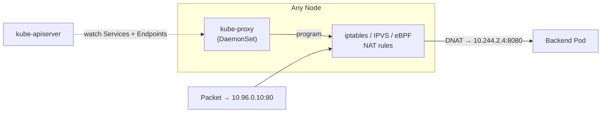
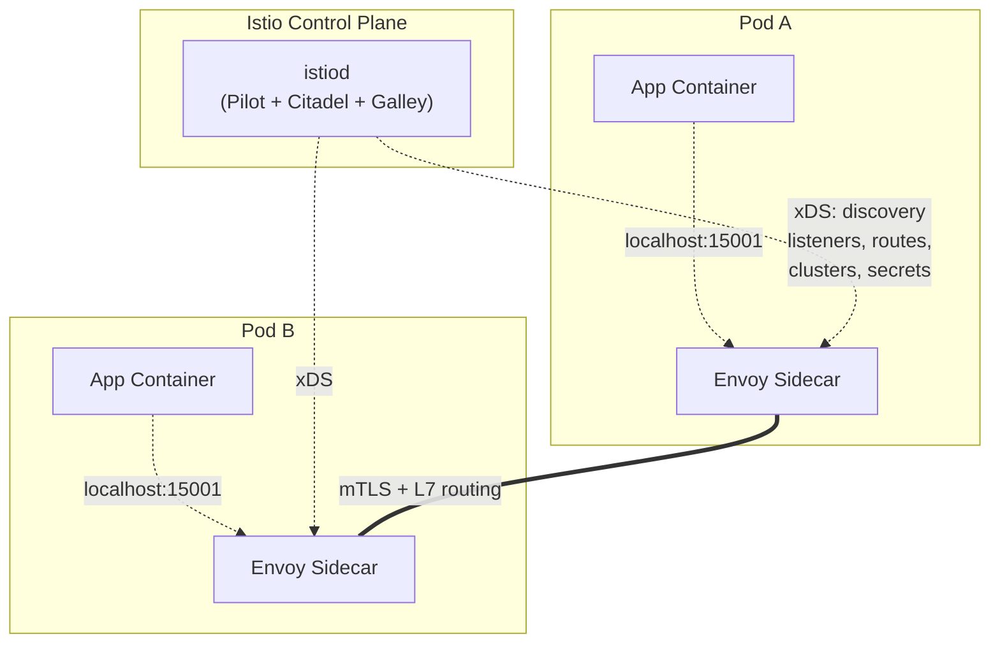
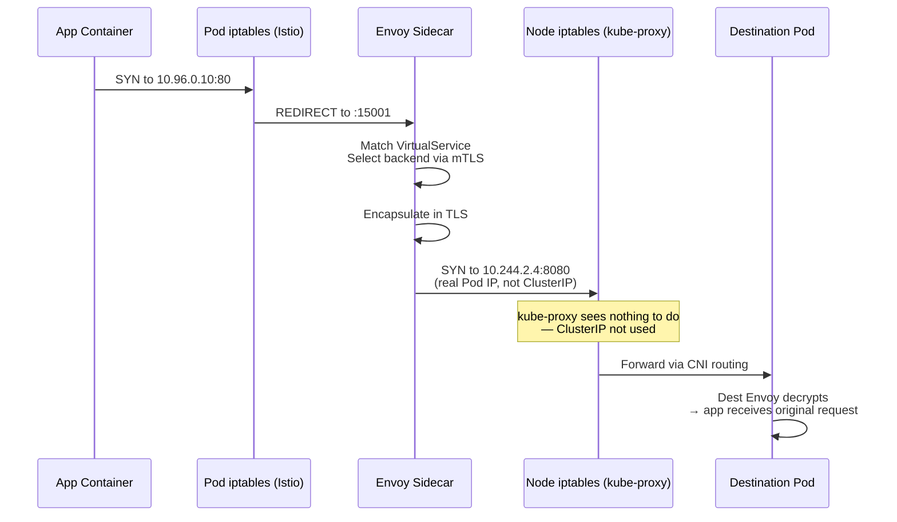
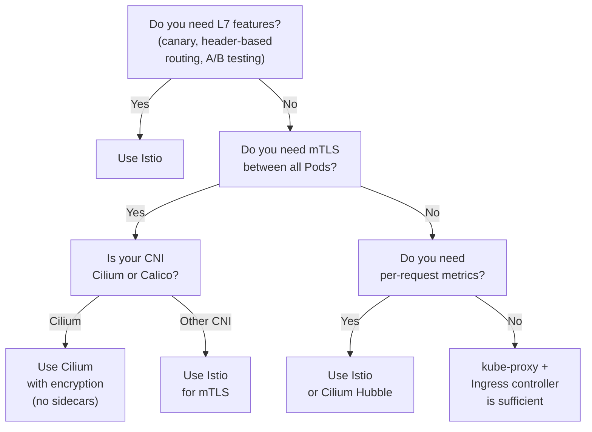

If you've spent any time with Kubernetes, you've encountered this question — either from a colleague, a manager, or your own skepticism:

> "kube-proxy already load-balances traffic to Services. Why do I need Istio?"

It's a fair question. kube-proxy has been part of Kubernetes since v1.0. It works, it's stable, and it handles the fundamental task of directing traffic from a stable virtual IP to the actual Pod IPs. Adding a service mesh — with its sidecar proxies, control plane, and certificate management — feels like unnecessary complexity.

But the question rests on a misunderstanding: **kube-proxy and Istio solve different problems at different layers of the OSI model.** This post explains exactly what each one does, why their capabilities differ, and when you genuinely need Istio.

---

## What kube-proxy Actually Does

Let's be precise about kube-proxy's job before we talk about what's missing.

kube-proxy is a **L4 load balancer** that runs as a DaemonSet on every node. Its sole job: watch the Kubernetes API server for Service and EndpointSlice objects, and program **NAT rules** that redirect traffic from a Service's ClusterIP (a virtual IP) to the IP addresses of the healthy backend Pods.



The rules it writes are straightforward. In iptables mode:

```bash
# Match ClusterIP:80
-A KUBE-SERVICES -d 10.96.0.10/32 -p tcp --dport 80 -j KUBE-SVC-XXXX

# Load balance across endpoints
-A KUBE-SVC-XXXX -m statistic --mode random --probability 0.333 -j KUBE-SEP-AAA
-A KUBE-SVC-XXXX -m statistic --mode random --probability 0.500 -j KUBE-SEP-BBB
-A KUBE-SVC-XXXX -j KUBE-SEP-CCC

# DNAT to actual Pod IP
-A KUBE-SEP-AAA -p tcp -j DNAT --to-destination 10.244.2.4:8080
```

In IPVS mode, the outcome is the same — just more efficient: one hash table entry per ClusterIP instead of a linear rule list.

**That's the complete feature set of kube-proxy:**

| Feature | Supported? | How? |
|---------|-----------|------|
| L4 load balancing | Yes | DNAT with random/round-robin selection |
| Health checking | Yes | Watches EndpointSlice — removes Pods with `readinessProbe: false` |
| Session affinity | Yes | `service.spec.sessionAffinity: ClientIP` (iptables `--persistent` flag) |
| External traffic policy | Yes | `externalTrafficPolicy: Local` skips SNAT |
| NodePort + LoadBalancer | Yes | Extra iptables rules for host port + cloud LB integration |

**What kube-proxy does not do:**

| Feature | kube-proxy |
|---------|-----------|
| L7 routing (HTTP path/header/method) | ❌ |
| mTLS between Pods | ❌ |
| Circuit breaking | ❌ |
| Retries + timeouts | ❌ |
| Traffic splitting (canary, blue-green) | ❌ |
| Per-request metrics (latency, error rate) | ❌ |
| Fault injection for testing | ❌ |
| Distributed tracing | ❌ |
| Access control at L7 | ❌ |

These aren't bugs — they're design boundaries. kube-proxy operates at **L4 (TCP/UDP)** and has no knowledge of HTTP, gRPC, or any application protocol. It was designed to solve one problem (stable ClusterIP → Pod routing) and solve it well.

## How Istio Fills the Gap

Istio adds an entirely new data plane between Pods. Instead of one kube-proxy per node, Istio runs one **Envoy proxy per Pod** as a sidecar container. Every packet entering or leaving the Pod goes through this proxy — redirected by iptables rules injected by the `istio-init` init container.

### The architecture



The control plane, **istiod**, is a single binary that combines three formerly separate components (Pilot, Citadel, Galley). It watches the Kubernetes API server and translates Services, Deployments, and Istio CRDs (VirtualService, DestinationRule, etc.) into **Envoy xDS configuration** — the universal data plane API developed at Lyft.

The data plane, **Envoy**, is the heart of the system. It's a C++ proxy originally built at Lyft (open-sourced in 2016, donated to CNCF in 2017). Each Envoy instance receives its configuration from istiod via xDS and applies it to every connection:

| xDS resource | What it configures |
|--------------|-------------------|
| **LDS** (Listener Discovery) | Which ports to listen on (e.g., inbound 15006, outbound 15001) |
| **RDS** (Route Discovery) | Which routes map to which clusters |
| **CDS** (Cluster Discovery) | Upstream service endpoints |
| **EDS** (Endpoint Discovery) | Individual Pod IPs for each cluster |
| **SDS** (Secret Discovery) | TLS certificates for mTLS |

### The traffic interception mechanism

Istio installs iptables rules via an init container (`istio-init`) that runs before the application starts:

```text
# Inbound: redirect port 80 → Envoy's inbound listener (15006)
iptables -t nat -A PREROUTING -p tcp --dport 80 -j REDIRECT --to-port 15006

# Outbound: redirect everything → Envoy's outbound listener (15001)
iptables -t nat -A OUTPUT -p tcp ! -d 127.0.0.1/32 -j REDIRECT --to-port 15001
```

These rules have higher priority than kube-proxy's DNAT rules because they fire in the **OUTPUT chain of the Pod's network namespace**, before the packet ever reaches the host's PREROUTING chain where kube-proxy rules live. This means:

1. Application sends packet to `my-service:80`
2. Pod's iptables (Istio's) intercept and redirect to local Envoy
3. Envoy looks up route, selects destination Pod, establishes mTLS
4. Envoy sends mTLS-encrypted packet to destination Envoy
5. Destination Envoy decrypts and forwards to application

The original kube-proxy DNAT rules never fire — the traffic never reaches the host's PREROUTING chain because Istio's iptables rules handle everything inside the Pod's network namespace.



### The capabilities kube-proxy cannot match

**L7 traffic management:**

```yaml
apiVersion: networking.istio.io/v1beta1
kind: VirtualService
metadata:
  name: reviews-routing
spec:
  hosts:
    - reviews
  http:
    - match:
        - headers:
            end-user:
              exact: sauraj
      route:
        - destination:
            host: reviews
            subset: v2
    - route:
        - destination:
            host: reviews
            subset: v1
```

This routes traffic based on an HTTP header — something kube-proxy cannot do in any configuration. You can match on URI, method, headers, query parameters, source labels, and more. This enables canary deployments, A/B testing, and blue-green rollouts without changing any application code.

**Automatic mTLS:**

```yaml
apiVersion: security.istio.io/v1beta1
kind: PeerAuthentication
metadata:
  name: default
  namespace: istio-system
spec:
  mtls:
    mode: STRICT
```

With this single resource, every Pod-to-Pod connection in the mesh is encrypted with mutual TLS. Each Envoy has a **SPIFFE-compliant identity** (`spiffe://cluster.local/ns/<namespace>/sa/<service-account>`) issued by istiod's built-in CA. Certificates are rotated automatically.

**Observability per-request:**

Envoy emits detailed metrics for every request: `istio_requests_total{response_code, source, destination, response_flags}`. These feed into Prometheus and are visualized in Kiali:

- Success/error rate per route
- p50/p90/p99 latency per service
- Traffic graph (who talks to whom and how)
- Distributed tracing via Envoy's Zipkin/Jaeger integration

**Resilience:**

```yaml
apiVersion: networking.istio.io/v1beta1
kind: DestinationRule
metadata:
  name: reviews-circuit-breaker
spec:
  host: reviews
  trafficPolicy:
    connectionPool:
      tcp:
        maxConnections: 100
      http:
        http1MaxPendingRequests: 10
        maxRequestsPerConnection: 10
    outlierDetection:
      consecutive5xxErrors: 5
      interval: 30s
      baseEjectionTime: 30s
```

Circuit breaking, retries (max 3 attempts, per-try timeout), timeouts (per-request), and connection pooling — all configured declaratively and enforced entirely in the Envoy sidecar, without touching the application.

## The Counterargument: Do You Need All That?

Despite the capabilities above, many production clusters run perfectly well without Istio. Here's when you truly do not need it:

**You do not need Istio if:**

1. **Your services are simple L4 consumers.** If you're running a stateless web app behind a single Ingress and all internal traffic is simple round-robin, kube-proxy + an ingress controller (nginx-ingress, Traefik) covers your needs.

2. **Your security boundary is already tight.** If you use CiliumNetworkPolicy (which supports L7 + mTLS at the CNI layer via eBPF), you already get encryption, identity-aware policies, and observability without the sidecar overhead. Cilium's encryption (WireGuard or IPsec) operates at L3 and has lower latency than Envoy-to-Envoy mTLS.

3. **Your latency budget is tight.** Each Envoy hop adds ~2–5ms on the p99. For high-frequency trading, real-time video processing, or embedded systems, that overhead may be unacceptable. kube-proxy's L4 DNAT adds microseconds, not milliseconds.

4. **Your team is small or overstretched.** Istio adds operational complexity: sidecar injection, control-plane upgrades, Envoy resource tuning, and debugging `503 UH` (upstream unhealthy) errors. If your team can't afford the learning curve, the mesh will be a liability.

**You do need Istio if:**

1. **You need canary deployments with fine-grained traffic splitting.** 10% of traffic to v2, 90% to v1, gated by a header — Istio is the standard solution.

2. **You need mTLS across heterogeneous workloads.** If some services run in Kubernetes and others on VMs (Istio supports VM mesh via WorkloadEntry), mTLS works the same everywhere.

3. **You need deep L7 observability.** The Kiali traffic graph and per-route latency/error metrics are virtually impossible to replicate without a mesh.

4. **You need fault injection for chaos engineering.** Istio lets you inject HTTP delays and aborts declaratively — `kubectl apply` a fault-injection rule, test your system, then `kubectl delete` it. No code change, no redeploy.

## The Decision Framework



## The Cost Breakdown

Istio's benefits come with real costs:

| Resource | kube-proxy only | kube-proxy + Istio |
|----------|----------------|-------------------|
| Per-node CPU (kube-proxy) | ~0.1 vCPU | ~0.1 vCPU (kube-proxy still runs) |
| Per-Pod CPU (Envoy sidecar) | 0 | ~0.5–1 vCPU under load |
| Per-Pod memory (Envoy sidecar) | 0 | ~50–150 MB |
| p99 latency (internal request) | ~1–2ms | ~3–8ms |
| Startup latency | ~0 (kernel rules) | ~2–5s (Envoy warmup + xDS sync) |
| API server load | Low | Moderate (each Envoy watches relevant config) |

## The Historical Arc

Istio launched in May 2017 as a collaboration between Google, IBM, and Lyft (Envoy's creator). Linkerd (the first service mesh) had launched in 2016, but Istio popularized the term and architecture:

- **v1.0** (July 2018): first production release. Three-component control plane (Pilot, Mixer, Citadel). Mixer was a policy/telemetry component that became a bottleneck.
- **v1.5** (March 2020): merged the control plane into a single binary — `istiod`. Removed Mixer, moving telemetry into Envoy directly.
- **v1.10** (June 2021): improved VM integration, delta xDS for reduced config overhead.
- **v1.16** (2023): ambient mesh mode introduced — no sidecars required (node-level ztunnel proxies instead).
- **v1.20+** (2025): Waypoint proxies for a middle ground between sidecars and ambient.

The major competing meshes:

| Mesh | Proxy | Control Plane | Inception | Specialty |
|------|-------|---------------|-----------|-----------|
| **Linkerd** | Linkerd2-proxy (Rust) | `linkerd-controller` | 2016 | Simplicity, low resource usage (~10MB/sidecar) |
| **Consul Connect** | Envoy | Consul Server | 2018 | Multi-platform (VMs + K8s + Nomad) |
| **Cilium** | Envoy (optional) + eBPF | Cilium Agent | 2017 | No sidecar needed for L3/L4; L7 via Envoy |
| **Kuma** | Envoy | `kuma-cp` | 2020 | Multi-cluster, multi-mesh, universal |

## The Mental Model

> kube-proxy solves "how do I reach any healthy Pod behind a stable IP?" at L4 with DNAT. Istio solves "how do I reach a Pod with security, observability, and resilience guarantees?" at L7 with sidecar proxies. They are not alternatives — they are complementary layers. kube-proxy handles the base connectivity that Istio's Envoys communicate over, while Istio adds application-aware routing, encryption, and telemetry on top.

If you don't need L7 features, mTLS, or detailed observability, kube-proxy is enough. If you need any of those three, the overhead of a mesh is justified — and Istio is the most battle-tested option.

---

## References

- [Istio Architecture](https://istio.io/latest/docs/ops/deployment/architecture/)
- [kube-proxy Documentation](https://kubernetes.io/docs/concepts/services-networking/service/#proxy-mode-iptables)
- [Envoy Proxy Architecture](https://www.envoyproxy.io/docs/envoy/latest/intro/arch_overview/intro)
- [Service Mesh Comparison: Istio vs Linkerd vs Cilium](https://layer5.io/resources/service-mesh-comparison)
- [Istio mTLS Documentation](https://istio.io/latest/docs/concepts/security/#mutual-tls-authentication)
- [Citadel CA (Istio Security)](https://istio.io/latest/docs/concepts/security/#pki)
- [Cilium NetworkPolicy with L7](https://docs.cilium.io/en/latest/security/language/)
- [Linkerd Documentation](https://linkerd.io/2.15/features/)
